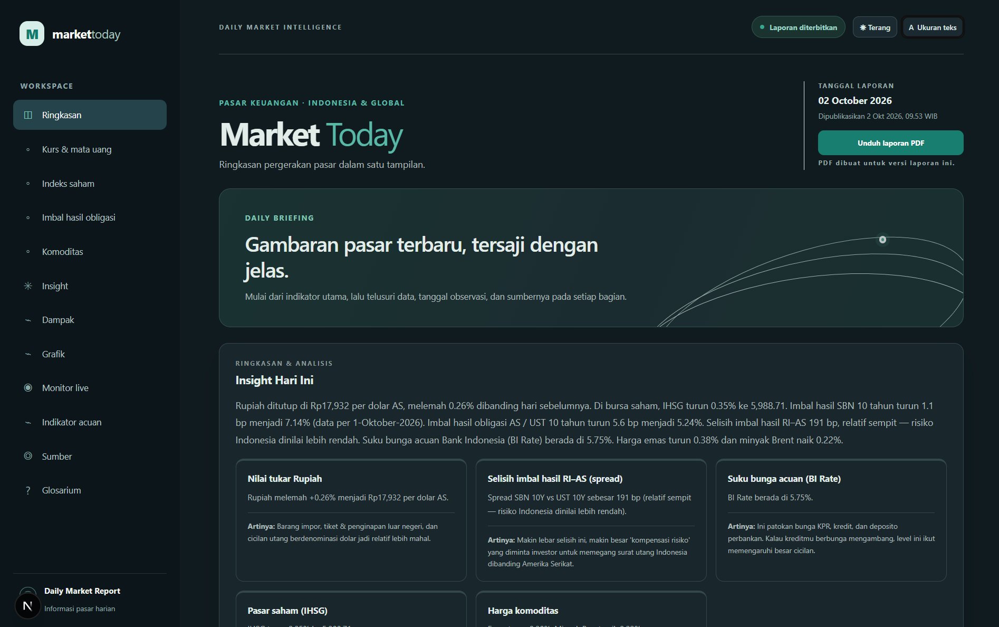
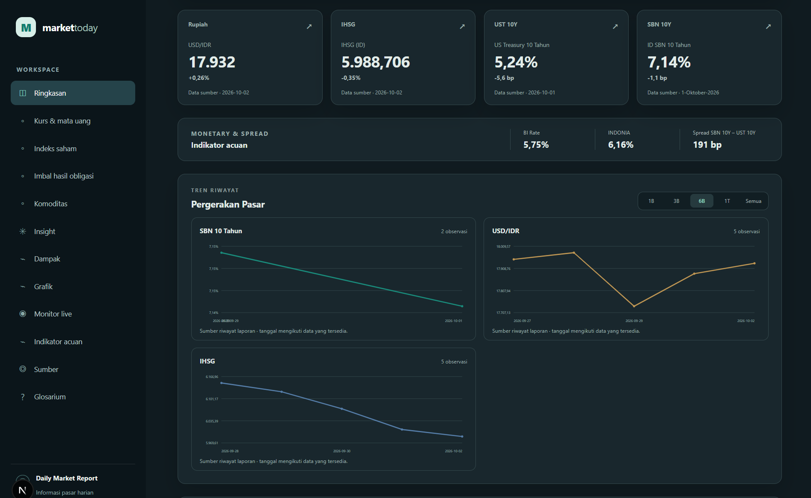

# Daily Market Report — Dashboard & Automation

## Preview

| Landing Page - Ringkasan Pasar | Landing Page - Detail Tren & PDF |
| :---: | :---: |
|  |  |

*Gambar menggunakan data simulasi untuk memperlihatkan tampilan aplikasi; nilainya bukan data pasar aktual.*

Website **Market Today** menyajikan data pasar Indonesia dan global. FastAPI membaca laporan
berversi, PostgreSQL menyimpan antrean pembaruan, dan worker menyiapkan refresh serta PDF.


```
Sumber pasar (Yahoo Finance + PHEI + BI)
        ↓
Backend Python (pengambilan + validasi + analisis)
        ↓
FastAPI + PostgreSQL + worker
        ↓
Frontend Next.js + laporan PDF
```

---

## Acuan proyek

- [Project Brief](docs/PROJECT_BRIEF.md): tujuan produk, pengguna, fitur, data, pengalaman pengguna, operasional, roadmap, dan kriteria keberhasilan.

README ini berisi panduan instalasi dan penggunaan teknis. Kondisi produk serta progres pengembangan dirangkum dalam Project Brief.

## 1. Menyiapkan aplikasi

Gunakan Python 3.10 atau lebih baru dan Node.js 20.9 atau lebih baru. Checkout proyek ini,
lalu siapkan dependensi backend dan frontend.

### Windows (PowerShell)

```powershell
py -m venv .venv
.\.venv\Scripts\python.exe -m pip install -r backend\requirements.txt
Set-Location frontend
npm ci
if (-not (Test-Path .env.local)) { Copy-Item .env.example .env.local }
Set-Location ..
if (-not (Test-Path .env)) { Copy-Item .env.example .env }
```

### Linux / macOS

```bash
python3 -m venv .venv
.venv/bin/python -m pip install -r backend/requirements.txt
cd frontend && npm ci
test -f .env.local || cp .env.example .env.local
cd ..
test -f .env || cp .env.example .env
```

Isi `.env` dengan URL dan kredensial PostgreSQL serta token API. Isi `frontend/.env.local`
dengan `DAILY_MARKET_API_URL`, `API_READ_TOKEN`, `API_OPERATOR_TOKEN`, kata sandi operator,
dan secret sesi. Nilai token baca harus sama pada kedua file; rahasia operator hanya disimpan
di lingkungan frontend. Jangan menimpa file konfigurasi yang sudah berisi nilai lokal.

Terapkan schema database satu kali:

```powershell
.\.venv\Scripts\python.exe backend/src/market_report/apply_schema_migrations.py
```

Jalankan API dan worker pada terminal terpisah dari root proyek:

```powershell
.\.venv\Scripts\python.exe -m uvicorn market_report.api.main:app --app-dir backend/src --host 127.0.0.1 --port 8000
```

```powershell
.\.venv\Scripts\python.exe backend/src/market_report/worker/main.py
```

Jalankan website dari direktori `frontend` dengan `npm run dev`. Bila database belum
memiliki laporan, minta refresh dari menu **Pengelolaan** setelah API dan worker aktif.
Worker juga dapat dijadwalkan dengan menjalankan
`.\.venv\Scripts\python.exe backend/src/market_report/scheduler/main.py` secara terpisah.

Kode aplikasi menggunakan `backend/requirements.txt`. Berkas Streamlit lama seperti root
`requirements.txt`, `src/app.py`, dan `legacy/` mungkin masih ada pada checkout pengembangan,
tetapi bukan bagian dari alur clone dan menjalankan website Next.js.

### Package backend dan direktori deployment

Kode backend berada di `backend/src/market_report/`. Untuk instalasi sebagai package:

```powershell
python -m pip install ./backend
python -m market_report.apply_schema_migrations
python -m uvicorn market_report.api.main:app --host 127.0.0.1 --port 8000
python -m market_report.worker.main
```

Perintah ini berlaku setelah backend dipasang sebagai package melalui perintah pertama.

Perintah tersebut dijalankan terpisah sesuai kebutuhan; migrasi schema dijalankan sebelum
layanan memakai database. Wheel menyertakan SQL dari `backend/migrations/` dan proses
migrasi akan berhenti jika berkas SQL tidak tersedia.

Dalam checkout, root proyek ditemukan dari struktur `backend/src/`. Pada instalasi wheel,
root default adalah direktori kerja proses. Untuk lokasi tetap, set
`DAILY_MARKET_PROJECT_ROOT` di lingkungan proses sebelum startup agar `.env` dapat ditemukan.
`DAILY_MARKET_RUNTIME_DIR` mengatur lokasi data/chart/PDF runtime; nilai relatif dihitung dari
root proyek. Tanpa konfigurasi ini lokasi default adalah `<root>/runtime/`.
`REPORT_ARTIFACT_DIR` dapat mengganti lokasi PDF secara khusus. API, worker, dan scheduler
harus memakai konfigurasi root yang sama; API dan worker juga harus berbagi folder PDF.

### Penyimpanan laporan dan riwayat versi

Secara default, aplikasi tetap memakai JSON lokal. Setiap laporan yang diterbitkan disimpan
sebagai versi di `runtime/data/report_data_versions/`, sedangkan `runtime/data/report_data.json` menunjuk
versi aktif. Riwayat SBN juga diarahkan ke repository yang sama. Untuk mulai memakai
PostgreSQL, salin `.env.example` menjadi `.env`, isi kredensial database, lalu impor data
lokal dengan:

```powershell
python backend/src/market_report/migrate_reports_to_postgres.py
```

Skrip migrasi menerapkan schema pada berkas `backend/migrations/` secara otomatis. `DATABASE_URL`
dipakai oleh layanan laporan untuk membaca dan menerbitkan versi. Tanpa
variabel tersebut, layanan memakai repository JSON. Lakukan backup data JSON sebelum impor;
skrip mempertahankan semua versi arsip yang memiliki ID, mengimpor hingga 30 titik riwayat
SBN, dan menjadikan laporan aktif lokal sebagai versi aktif terakhir.
Seluruh kolom tanggal pada tabel PostgreSQL memakai nama `dates`.

Untuk menerapkan perubahan schema tanpa mengimpor ulang snapshot lokal, jalankan:

```powershell
python backend/src/market_report/apply_schema_migrations.py
```

Perintah ini aman dijalankan berulang. `migrate_reports_to_postgres.py` tetap dipakai
untuk impor awal karena perintah tersebut juga dapat menjadikan snapshot lokal sebagai
laporan aktif database.

### API dan worker

FastAPI memuat konfigurasi `.env` dan membaca repository laporan yang sama dengan worker:

```powershell
python -m uvicorn market_report.api.main:app --app-dir backend/src --host 127.0.0.1 --port 8000
```

- `GET http://127.0.0.1:8000/api/v1/reports/latest` — laporan aktif.
- `GET http://127.0.0.1:8000/api/v1/reports/{report_id}` — versi tertentu.
- `GET http://127.0.0.1:8000/api/v1/instruments/{instrument_id}/history?report_id={report_id}&from=2026-01-01&to=2026-12-31` — riwayat instrumen dari versi laporan yang sama.
- `GET http://127.0.0.1:8000/api/v1/market/live` — kutipan live dengan cache 30 detik per proses.
- `POST http://127.0.0.1:8000/api/v1/refresh-jobs` — antrekan refresh (Bearer `API_OPERATOR_TOKEN`).
- `GET http://127.0.0.1:8000/api/v1/jobs/{job_id}` — status dan rangkaian event job.
- `POST http://127.0.0.1:8000/api/v1/reports/{report_id}/exports` — `200` dengan `status: ready` bila PDF tersedia, atau `202` dengan ID job ekspor.
- `GET http://127.0.0.1:8000/api/v1/reports/{report_id}/exports/pdf` — unduh PDF versi laporan.
- `GET http://127.0.0.1:8000/api/v1/artifacts/{artifact_id}` — unduh artefak menggunakan ID artefak.
- `GET http://127.0.0.1:8000/health` — status proses API.
- `GET http://127.0.0.1:8000/docs` — dokumentasi interaktif.

ID riwayat yang tersedia: `sbn-10y`, `us-10y`, `us-5y`, `usd-idr`, `eur-idr`, `cny-idr`,
`jpy-idr`, `dxy`, `ihsg`, `dji`, `gold`, `brent`, dan `wti`. Instrumen yang dikenal tetapi
belum memiliki seri tersimpan mengembalikan daftar titik kosong.

Frontend selalu mengirim `report_id` pada permintaan riwayat agar grafik mengikuti versi laporan
yang dirender. Versi yang tidak ditemukan mengembalikan `404`. Riwayat SBN pada versi lama
yang belum menyimpan seri sendiri tetap kosong; grafik dan PDF tidak mengambil riwayat terbaru
untuk menggantikan riwayat versi tersebut. Parameter ini opsional bagi pemanggil API lama.

API baca memerlukan header `Authorization: Bearer <API_READ_TOKEN>`. Isi token acak di `.env`
(dapat dibuat dengan `python -c "import secrets; print(secrets.token_urlsafe(32))"`). Simpan
token di server pemanggil, bukan di kode browser. Endpoint refresh memakai token terpisah
`API_OPERATOR_TOKEN`; permintaan duplikat memakai kembali job yang masih antre atau berjalan.

Jalankan worker dalam terminal/proses terpisah:

```powershell
python backend/src/market_report/worker/main.py
```

Worker memproses satu refresh pada satu waktu, mencoba ulang kegagalan hingga tiga kali,
memperpanjang lease setiap 30 detik, dan memulihkan job setelah lease dua menit kedaluwarsa.
Worker lama yang kehilangan kepemilikan tidak dapat menerbitkan laporan.
Setelah report terbit, worker juga mencoba menyimpan PDF laporan ke `runtime/reports/`; kegagalan
PDF dicatat di log dan tidak membatalkan laporan yang sudah berhasil diterbitkan.
Ekspor versi tertentu dapat diminta melalui endpoint API; worker memprosesnya dan menyimpan
metadata artefak di PostgreSQL. Worker dan API harus berbagi folder artefak yang sama;
atur `REPORT_ARTIFACT_DIR` ke folder persisten bila direktori default `runtime/reports/` tidak sesuai.
Nilai relatif dihitung dari root project.
Permintaan ekspor yang belum memiliki berkas PDF dibatasi 10 per menit per proses API;
kelebihan permintaan menerima `429` dengan `Retry-After`. PDF yang sudah tersedia tidak
memakai kuota tersebut. Worker mengunci pembuatan PDF per versi di PostgreSQL dan memakai
kembali artefak yang ada. Berkas dipublikasikan melalui penggantian atomik setelah selesai ditulis.
Saat `DATABASE_URL` diatur, tombol refresh dashboard dan perintah CLI live memasukkan job
ke antrean ini. Jalankan worker agar permintaan diproses; setelah status berhasil, muat ulang
dashboard untuk melihat laporan terbaru. Mode tanpa PostgreSQL mempertahankan refresh lokal.

### Scheduler refresh

Isi `REFRESH_TIMES` di `.env` dengan satu atau lebih jam lokal format `HH:MM`, dipisahkan
koma, misalnya `16:30`. Zona waktu default `Asia/Jakarta` dan dapat diubah melalui
`REFRESH_TIMEZONE`. Jalankan scheduler sebagai proses terpisah dari worker:

```powershell
python backend/src/market_report/scheduler/main.py
```

Scheduler mencatat setiap slot secara persisten di PostgreSQL, sehingga restart dan beberapa
instans scheduler tidak mengantrekan slot yang sama berulang kali. Slot yang terlewat masih
dapat dimasukkan dalam jendela `REFRESH_CATCHUP_MINUTES` (default 10). Untuk deployment,
jalankan scheduler dan worker sebagai proses layanan terpisah yang otomatis aktif kembali.

### Frontend Next.js

Frontend Next.js di `frontend/` adalah antarmuka aktif. Halaman dashboard membaca laporan aktif melalui API. Gunakan Node.js 20.9 atau lebih baru, lalu
siapkan konfigurasi berdasarkan `.env.example` di direktori proyek untuk FastAPI dan worker.
Untuk Next.js, salin `frontend/.env.example` menjadi `frontend/.env.local`; Next.js memuat konfigurasi
frontend dari direktori saat ini. Nilai `API_READ_TOKEN` di `frontend/.env.local` harus sama
dengan yang ada di `.env` utama. Rahasia ini hanya dipakai server dan tidak masuk ke browser:

```powershell
cd frontend
npm install
npm run dev
```

Jalankan FastAPI, PostgreSQL, dan worker secara terpisah. `API_READ_TOKEN` dipakai oleh
server Next.js untuk membaca laporan dan data live. Untuk refresh dari web, konfigurasi
`API_OPERATOR_TOKEN`, `WEB_OPERATOR_PASSWORD`, dan `WEB_OPERATOR_SESSION_SECRET` pada
lingkungan server Next.js. Gunakan kata sandi operator khusus minimal 16 karakter dan
secret sesi acak minimal 32 karakter. Login web membuat cookie HttpOnly dengan masa berlaku 8 jam; token API tidak
dikirim ke browser. Lima kegagalan login dalam 15 menit memicu jeda 15 menit. Secara bawaan
semua klien berbagi pembatas karena header IP yang dikirim pemanggil tidak dipercaya.
Set `WEB_TRUST_PROXY=true` hanya jika Next.js dapat diakses melalui proxy tepercaya yang
menimpa `X-Real-IP` dengan alamat klien valid dan menutup akses langsung ke Next.js.
Dalam konfigurasi itu pembatas berlaku per IP; `X-Forwarded-For` tetap diabaikan.
Penyimpanan dibatasi 2.000 entri, dengan bucket bersama saat kapasitas penuh.
Pembatas ini disimpan per proses Next.js, jadi gunakan satu instance sampai pembatas bersama
dikonfigurasi. Jangan menaruh rahasia ini di variabel `NEXT_PUBLIC_*` atau kode frontend.

Monitor live memperbarui tampilan setiap 60 detik dan menggunakan snapshot laporan sebagai
cadangan ketika sumber live tidak tersedia. Endpoint API memakai cache singkat 30 detik.
Dashboard menempatkan angka utama dan indikator acuan di atas, dilanjutkan insight,
grafik historis, tabel detail, dan monitor live. Sumber serta glosarium berada di bawah;
glosarium dan dampak praktis dapat dibuka sesuai kebutuhan. Klik **Pengelolaan** di header
untuk membuka login operator dan kontrol refresh laporan.
Tombol refresh memasukkan job ke antrean dan menunggu status worker sebelum memuat laporan
versi baru. Next.js merupakan antarmuka aktif; Streamlit hanya tersedia pada checkout lama
yang masih memiliki berkas transisinya.

### Streamlit lama di checkout lokal

Streamlit dipertahankan sebagai jalur transisi pada salinan kerja lama. Berkas root
`requirements.txt`, `src/app.py`, dan `legacy/` dikecualikan dari repository aktif, sehingga
perintah Streamlit berikut hanya berlaku bila berkas tersebut tersedia di checkout lokal.
Untuk clone baru, gunakan aplikasi Next.js pada bagian instalasi di atas.

### Isi sidebar Streamlit lama

| Kontrol | Kegunaan |
|---------|----------|
| **Status data** | Menampilkan mode (**LIVE** / **DEMO**), tanggal laporan, dan waktu snapshot yang sedang tampil. |
| **🔄 Perbarui data dari sumber (live)** | Mengambil data dari Yahoo, PHEI, dan BI, menghitung ulang, lalu memuat ulang halaman. Perlu koneksi internet yang mengizinkan akses ke sumber-sumber tersebut. |
| **Ambil data otomatis bila snapshot belum ada** | Kalau `runtime/data/report_data.json` belum ada, dashboard mengambil data sendiri saat pertama dibuka. |
| **Tampilkan bagian teknis (sumber data)** | Dimatikan bila halaman hanya dipresentasikan ke pembaca non-teknis (menyembunyikan bagian Sumber Data & Metode). |

### Cara agar data selalu ter-update di dashboard

1. Buka sidebar → cek **status data** (mode dan waktu snapshot).
2. Klik tombol **🔄 Perbarui data dari sumber (live)**.
3. Jika minimal dua instrumen berhasil dibaca, laporan disimpan dan halaman dimuat ulang. Jika data tidak cukup, aplikasi menampilkan pesan gagal dan tetap memakai laporan terakhir.

Saat aplikasi dijalankan di lingkungan yang membatasi akses jaringan (misalnya sandbox),
semua sumber live dapat gagal dengan `WinError 10013`. Jalankan Streamlit dari terminal
yang memiliki akses internet, lalu gunakan tombol pembaruan di sidebar.

### Mode terang & gelap

Panel **🎨 Kustomisasi tampilan** (ikon palet di kanan atas) menyediakan tombol
**☀️ Terang / 🌙 Gelap**, pengatur skala teks, dan pilihan warna aksen. Pilihan
disimpan di `localStorage`, jadi mode gelap tidak hilang saat Streamlit
me-render ulang halaman (mis. ketika expander dibuka).

Widget bawaan Streamlit — `st.expander`, `st.container(border=True)`, dan
`st.info` / `st.error` — warnanya berasal dari **tema Streamlit**, bukan dari
token aplikasi. Karena itu tiap warna ditulis eksplisit di kedua mode lewat
token `--mt-native-*`. Tanpa itu, mode terang akan menampilkan teks putih di
atas panel putih — termasuk di bagian **Sumber Data & Metode**.

Setiap latar bertumpuk (`stApp`, `stAppViewContainer`, `stMain`) juga
diikutkan agar tidak ada panel putih tertinggal di tengah mode gelap.

Untuk memastikan, jalankan:

```bash
python tools/cek_kontras.py   # mengukur rasio kontras WCAG di kedua mode
```

---

## 3. Susunan halaman & cara membacanya

Halaman disusun mengikuti cara orang membaca: **inti lebih dulu, detail kemudian** — dan memakai
**jarak putih + tab** supaya tidak terasa seperti laporan bertumpuk. Bagian tidak lagi diberi
nomor; tiap bagian ditandai pil kecil + judul besar.

| Bagian | Isi |
|--------|-----|
| **Header** | Angka paling penting (Rupiah, IHSG, SBN 10Y, spread SBN–UST) + sentimen harian. |
| **Insight Hari Ini** | Satu paragraf ringkasan otomatis, lalu 3 kartu sorotan (angka + artinya). Sisanya dilipat di "Sorotan lain hari ini". |
| **Apa Artinya untuk Anda** | Dampak praktis: belanja luar negeri, cicilan/kredit, tabungan & obligasi, harga barang. |
| **Angka Kunci Hari Ini** | 4 kartu besar (USD/IDR, IHSG, SBN 10Y, spread) + 4 kartu pendukung (DXY, UST 10Y, emas, Brent) + baris chip BI Rate / INDONIA / JISDOR. |
| **Grafik** | Dua grafik dengan **angka yang diambil ulang otomatis** + tombol **🔄 Perbarui sekarang**. |
| **Detail Pasar** | Empat tabel dalam tab: Nilai Tukar, Pasar Saham, Imbal Hasil Obligasi, Komoditas. |
| **Glossarium Istilah & Cara Membaca** | Kamus istilah + panduan membaca 30 detik (bertab). |
| **Unduh Laporan (PDF)** | PDF disusun dari angka yang sedang tampil (tombol 📄 Unduh PDF), plus tombol ambil data terbaru & simpan arsip. |
| **Sumber Data & Metode** | Bagian teknis (opsional): sumber per instrumen, seri, dan waktu pengambilan data. |

### Tampilan PDF

PDF disusun sebagai laporan korporat 3 halaman, memakai design token yang sama
dengan dashboard agar terlihat satu produk:

| Bagian | Isi |
|--------|-----|
| **Kop** | Bar aksen di tepi atas, judul *Market Today*, tanggal laporan + jam snapshot. |
| **Angka Kunci** | Lima kartu (USD/IDR, IHSG, SBN 10Y, UST 10Y, Spread) dengan nilai besar dan perubahan berwarna. |
| **Ringkasan Singkat** | Call-out dengan bar aksen kiri; versi bahasa sederhana untuk pembaca non-ekonom. |
| **Sesi 1–5** | Tabel bernomor: Exchange Rate, Financial Market, Yield, Monetary Policy, Commodities. |
| **Sesi 6–7** | Grafik *Rate Differential* dan *Pergerakan Kurs*, masing-masing berbingkai + caption sumber. |
| **Sesi 8** | Tabel sumber per kelompok instrumen, catatan metode, dan disclaimer. |
| **Setiap halaman** | Kepala halaman berjalan, footer sumber, dan nomor **Halaman X dari Y**. |

Detail yang disengaja:
- **Warna mengikuti arah dampak.** Pada kurs, angka positif berarti rupiah melemah
  sehingga merah; pada saham dan imbal hasil, naik = hijau.
- **Panah arah digambar sebagai vektor**, bukan karakter Unicode, karena font
  dasar PDF tidak menyediakan glyph segitiga.
- **Grafik tidak diregangkan** — ukuran diambil dari berkas PNG itu sendiri.
- **Font tetap Helvetica** agar teks bisa dicari/dicopy dan ukuran berkas kecil.
- **Metadata PDF** (judul, penulis, subjek) ikut diisi agar rapi di file manager.
- **`report_pdf` tidak mengimpor `app.py`.** Modul PDF tidak menggambar grafik
  sendiri; pemanggil menggambarnya lalu meneruskan path-nya lewat
  `chart_path` / `fx_chart_path`. Alasannya: Streamlit menjalankan `app.py`
  sebagai `__main__`, sehingga `import app` dari dalam fungsi ber-`@st.cache_data`
  akan mengeksekusi ulang seluruh skrip dan memicu `CachedWidgetWarning`.

### Angka langsung (grafik yang benar-benar bergerak)

Bagian **Grafik Bergerak Langsung** memakai angka yang **diambil ulang dari Yahoo Finance**
(intraday), bukan snapshot harian — sehingga angkanya berubah setiap kali disegarkan.

| Kontrol | Kegunaan |
|---------|----------|
| **Segarkan otomatis** | `Manual` (hanya saat tombol ditekan) / `30 detik` / `1 menit` / `5 menit`. Penyegaran berjalan di `st.fragment`, jadi hanya bagian grafik yang dirender ulang, bukan seluruh halaman. |
| **🔄 Perbarui sekarang** | Mengambil angka baru seketika (menambah `nonce`, sehingga cache 45 detik dilewati). |
| **Papan status chip** | Angka per kelas aset; baris atas menuliskan jumlah instrumen yang ter-update dan pukul waktunya, atau **SNAPSHOT LAPORAN** bila sumber sedang tidak terjangkau (grafik lalu memakai angka laporan). |

Dua sumber angka sengaja dibedakan agar tidak saling bertentangan:

- **Snapshot harian** (`runtime/data/report_data.json`) → header, kartu angka kunci, seluruh tabel, PDF.
- **Harga terkini** (Yahoo Finance) → grafik saja, dengan stempel waktu di kaki grafik.

Riwayat SBN 10Y dikumpulkan sendiri oleh dashboard di `runtime/data/history_sbn.json` (satu titik per
tanggal, maksimum 30 hari). Karena PHEI hanya menerbitkan satu angka terakhir, garis SBN di
grafik dulu selalu datar; setelah beberapa hari dashboard dibuka, garisnya menjadi kurva sungguhan.

Prinsip keterbacaan lain yang tetap berlaku:

- **Warna punya arti yang konsisten**: hijau = cenderung menguntungkan, merah = cenderung memberatkan, abu-abu = relatif stabil.
- **Arah selalu ditulis dengan kata**, bukan hanya simbol: "▲ Rupiah melemah", "▼ Rupiah menguat", "▬ relatif stabil".
- **bp dijelaskan**: 1 bp = 0,01%.
- **Tanggal data ditampilkan** (data PHEI/BI bisa satu hari lebih lama dari kurs/saham).

### Pengaturan tampilan (opsional, tanpa mengubah data)

Klik tombol **🎨** di pojok kanan bawah halaman:

- **Ukuran teks** — Kecil / Normal / Besar (berguna untuk presentasi proyektor).
- **Warna aksen** — Teal / Biru / Ungu / Cokelat.
- **Mode tampilan** — Terang / Gelap.

Pengaturan ini hanya menyuntikkan CSS/JS ke browser saat itu: tidak disimpan ke file, cookie, atau data. Refresh halaman = kembali ke tampilan asli.

Data yang di-update:
- USD/IDR, DXY, EUR/IDR, CNY/IDR, JPY/IDR, SAR/IDR  
- IHSG, DJI  
- US Treasury 5Y / 10Y  
- Yield curve SBN + benchmark SBSN (dari [PHEI](https://www.phei.co.id/Data/HPW-dan-Imbal-Hasil))  
- BI Rate, INDONIA (Bank Indonesia)  
- Spread SBN 10Y − UST 10Y  
- Chart Rate Differential & FX Change %

Setelah live fetch, file berikut ikut ter-update:
- `runtime/data/snapshot.json` — raw data
- `runtime/data/report_data.json` — angka siap report
- `runtime/charts/rate_differential.png` (dari data snapshot, bukan angka contoh)
- `runtime/reports/Daily_Market_Update_YYYYMMDD.pdf` — nama file memakai tanggal laporan; file yang diunduh
  dashboard dibuat on-the-fly dari angka yang tampil (tidak memakai file lama di folder ini)

---

## 4. CLI Pipeline (tanpa Streamlit)

```bash
# Demo (angka sample)
python backend/src/market_report/run_pipeline.py --demo

# PostgreSQL: masukkan refresh ke antrean worker
python backend/src/market_report/run_pipeline.py

# Mode JSON lokal saja: pakai snapshot yang sudah ada (cepat, offline)
python backend/src/market_report/run_pipeline.py --no-fetch
```

Dalam mode PostgreSQL, perintah live mengantrekan refresh lalu keluar; worker harus
berjalan terpisah. Worker menyimpan PDF laporan ke `runtime/reports/` setelah laporan berhasil
diterbitkan. Dalam mode JSON lokal, CLI tetap menjalankan pipeline dan membuat keluaran
secara langsung.

Output CLI mode JSON lokal:
- Console summary (USD/IDR, DXY, yield, BI Rate, spread)
- PDF di `runtime/reports/`
- Chart di `runtime/charts/`

---

## 5. Agar data selalu update otomatis (tanpa klik manual)

Dashboard **tidak** fetch sendiri setiap detik. Agar data selalu fresh, jalankan pipeline secara berkala.

### Opsi A — Cron (Linux / macOS)

Edit crontab:

```bash
crontab -e
```

Contoh: update setiap hari kerja jam **16:30 WIB** (setelah pasar tutup):

```cron
30 16 * * 1-5  cd /path/ke/daily_market_report && /usr/bin/python3 backend/src/market_report/run_pipeline.py >> logs/pipeline.log 2>&1
```

Lalu buka dashboard kapan saja — data sudah terisi dari cron, jadi tidak perlu klik apa pun di sidebar.

### Opsi B — Task Scheduler (Windows)

1. Buka **Task Scheduler** → Create Basic Task.
2. Trigger: Daily, jam 16:30.
3. Action: Start a program  
   - Program: `python`  
   - Arguments: `backend/src/market_report/run_pipeline.py`
   - Start in: folder `daily_market_report`

### Opsi C — Auto-refresh di dalam Streamlit lama (opsional)

Tambahkan di sidebar interval auto-rerun (contoh setiap 30 menit) dengan fragment / `st.rerun` + timer. Untuk produksi, lebih aman menjalankan cron (pipeline menyimpan snapshot ke `runtime/data/report_data.json`) lalu membiarkan dashboard menampilkan snapshot tersebut — sumber data (yfinance / PHEI) tidak dibebani permintaan berulang.

### Opsi D — Deployment Streamlit lama

Petunjuk deployment Streamlit berikut hanya berlaku untuk salinan lama yang masih memuat
`src/app.py` dan dependensinya. Deployment aplikasi aktif perlu menjalankan frontend Next.js,
FastAPI, PostgreSQL, dan worker sebagai layanan terpisah.

- **Streamlit Community Cloud**: set main file `src/app.py` pada checkout lama.
- **Server sendiri**: `streamlit run src/app.py --server.port 8501` pada checkout lama.

---

## 6. Struktur direktori

Berikut ringkasan struktur aktif. Berkas runtime dan artefak migrasi lokal tidak disertakan
dalam clone baru.

```
daily_market_report/
├── docs/PROJECT_BRIEF.md     ← tujuan produk, lingkup, status, dan roadmap
├── backend/
│   ├── migrations/            ← migrasi schema PostgreSQL berurutan
│   ├── pyproject.toml         ← konfigurasi package Python
│   ├── requirements.txt       ← dependensi backend
│   └── src/market_report/     ← API, domain, layanan, worker, scheduler, pipeline
├── frontend/                  ← aplikasi Next.js
├── tests/                     ← pemeriksaan backend dan integrasi
├── tools/                     ← utilitas pengembang
├── .env.example               ← konfigurasi lokal server/backend
├── frontend/.env.example      ← konfigurasi lokal frontend
└── README.md
```
Data pasar, riwayat, grafik, dan laporan PDF disimpan sebagai keluaran runtime lokal dan
dikecualikan oleh `.gitignore`. Berkas `src/app.py`, `legacy/`, dan root `requirements.txt`
masih dapat ditemukan pada checkout transisi lama, tetapi tidak menjadi bagian dari struktur
aktif.

### Uji cepat setelah mengubah tampilan

```bash
python tests/smoke_app.py   # render dashboard & cek isi halaman  → HASIL: PASS
python tests/test_live.py   # cek logika angka langsung & grafik  → HASIL: PASS
python tests/test_pipeline.py # cek penerbitan snapshot & isolasi demo → HASIL: PASS
python tests/test_pdf.py    # cek isi PDF = angka yang tampil      → HASIL: PASS
python -B tests/test_api_worker.py # cek kontrak API, worker & scheduler lokal
python tools/cek_pdf.py     # cetak teks PDF per halaman (untuk cek tampilan)
python tools/cek_kontras.py # ukur kontras teks di mode terang & gelap
```

`tools/cek_kontras.py` menjalankan dashboard sungguhan di browser, membuka
bagian **Sumber Data**, lalu mengukur rasio kontras WCAG tiap teks terhadap
latar induknya pada kedua mode. Ini menangkap kasus "teks putih di atas
panel putih" yang tidak terlihat dari screenshot biasa.

`smoke_app.py` menjalankan dashboard di runtime uji Streamlit lalu memeriksa: tidak ada error,
8 bagian halaman muncul berurutan, 5 tabel + 8 tab ter-render, 2 grafik benar-benar dirender,
tombol perbarui grafik ada, dan cuplikan teks tiap kartu.

`test_live.py` tidak butuh internet: ia menguji penggabungan angka langsung (harga terkini vs
snapshot), penghitungan ulang persentase/bp/spread, pembentukan deret harian, pengumpulan riwayat
SBN, jalur cadangan saat sumber tidak terjangkau, dan kedua pembuat grafik.

---

## 7. Sumber data

| Data | Sumber | Keterangan |
|------|--------|------------|
| FX, DXY, IHSG, DJI, US yields | Yahoo Finance (`yfinance`) | Real-time / delayed |
| SBN & SBSN yields | [PHEI HPW & Imbal Hasil](https://www.phei.co.id/Data/HPW-dan-Imbal-Hasil) | Update harian |
| BI Rate, INDONIA, JISDOR | Bank Indonesia | BI Rate setelah RDG; INDONIA harian |
| Gold / Oil | yfinance (`GC=F`, `CL=F`) | Logam Mulia ada CAPTCHA → fallback yfinance |
| Commodities lain | TradingEconomics / investing.com | Best-effort |

---

## 8. Tips operasional

1. **Setelah pasar tutup** (sekitar 16:00–17:00 WIB) → klik **🔄 Perbarui data dari sumber (live)** di sidebar, atau jalankan `python backend/src/market_report/run_pipeline.py`.
2. Siang hari / presentasi → biarkan dashboard memakai snapshot terakhir (tidak perlu klik perbarui data) agar cepat dan stabil.
3. Jika PHEI atau BI lambat/error, pipeline tetap jalan dengan data yfinance; yield SBN bisa kosong sampai scraper sukses lagi.
4. PDF terbaru bisa di-download langsung dari tombol di bawah dashboard.
5. Jangan share `runtime/data/snapshot.json` ke publik jika berisi data internal; file ini hanya cache lokal.

---

## 9. Troubleshooting

| Masalah | Solusi |
|---------|--------|
| Data pasar kosong / pembaruan ditolak | Periksa pesan error dan `runtime/data/snapshot.json`; pastikan terminal memiliki akses internet ke Yahoo Finance dan PHEI, lalu klik **🔄 Perbarui data dari sumber (live)** lagi. Pembaruan dengan kurang dari dua instrumen berhasil ditolak agar tidak menimpa laporan yang ada. |
| Hanya sebagian instrumen yang muncul | Sumber berbeda dapat gagal secara terpisah. Cek bagian **Sumber Data & Metode** dan `runtime/data/snapshot.json`, lalu coba pembaruan lagi. |
| BI Rate / INDONIA / JISDOR tampak lama | Jika halaman BI tidak merespons, pipeline memakai angka cadangan; periksa tanggal pada bagian Sumber Data & Metode. |
| Perlu melihat data contoh | Jalankan `python backend/src/market_report/run_pipeline.py --demo` untuk demonstrasi lokal. Mode demo menulis `runtime/data/demo_report_data.json` secara terpisah dari laporan aktif. |
| Pembaruan data gagal | Cek koneksi dan akses jaringan ke sumber; coba lagi. Dashboard mempertahankan laporan terakhir yang berhasil disimpan. |
| Tampilan terasa berubah / tidak nyaman dibaca | Klik tombol **🎨** di pojok kanan bawah → **↺ Kembalikan tampilan asli**, atau refresh halaman (pengaturan tampilan tidak disimpan) |
| Perlu memastikan tampilan tidak rusak setelah diubah | Jalankan `python tests/smoke_app.py` (harus berakhir `HASIL: PASS`) |
| Chart tidak muncul | Pastikan `matplotlib` terinstall; jalankan pipeline sekali |
| Grafik tidak berubah saat disegarkan | Klik **🔄 Perbarui sekarang** (melempar cache), atau turunkan **Segarkan otomatis** ke 30 detik. Bila lencana tetap **SNAPSHOT LAPORAN**, sumber sedang tidak terjangkau — grafik memakai angka laporan |
| Angka grafik berbeda dari kartu/tabel | Itu memang disengaja: grafik memakai harga terkini, kartu & tabel memakai snapshot laporan agar konsisten satu hari penuh |
| PDF yang diunduh berbeda dari layar | PDF disusun dari `report` yang sedang dirender, jadi keduanya sama. Yang berbeda hanya **Grafik Bergerak Langsung** (harga intraday) — PDF memakai snapshot. Nama file mengikuti `report_date_iso` |
| PDF lama muncul di folder `runtime/reports/` | Itu arsip hasil run sebelumnya. Tombol 📄 selalu memakai angka terkini; arsip lain hanya disebut sebagai catatan |
| Port 8501 dipakai | `streamlit run src/app.py --server.port 8502` |

---

## 10. Ringkasan alur “data selalu update”

```
Setiap hari (manual atau cron)
        │
        ▼
python backend/src/market_report/run_pipeline.py     ← fetch live + calculate + chart + PDF
        │
        ▼
runtime/data/report_data.json ter-update
        │
        ▼
streamlit run src/app.py
  → Sidebar: cek status data; klik "🔄 Perbarui data dari sumber (live)" bila ingin angka real-time
  → Dashboard menampilkan angka & chart terbaru
  → Download PDF dari tombol di bawah
```

Dengan cara di atas, dashboard selalu menampilkan data ter-update tanpa harus mengisi angka manual.
