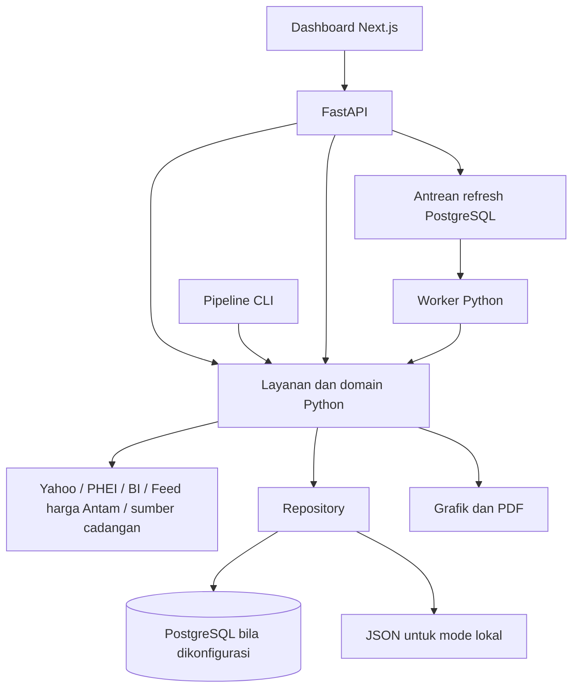

# Project Brief — Daily Market Report / Market Today

Versi dokumen: 1.6

Tanggal acuan: 7 Oktober 2026
Status produk: MVP/prototype yang sedang digunakan; pengembangan menuju aplikasi production dilakukan bertahap.

Dokumen ini menjadi acuan bersama untuk memahami produk, menetapkan prioritas, dan mengevaluasi perubahan. Kondisi implementasi dibedakan dari arah pengembangan. Target, peran pengguna, dan kebijakan operasional yang belum disepakati ditandai sebagai usulan atau keputusan terbuka.

## 1. Ringkasan produk

**Daily Market Report** adalah aplikasi informasi pasar yang menyajikan ringkasan harian, perubahan indikator utama, interpretasi kondisi pasar, grafik, dan laporan PDF. **Market Today** merupakan nama tampilan dashboard yang digunakan saat ini.

Produk membantu pembaca memahami kondisi pasar melalui satu tampilan yang terstruktur dan angka rinci. Asal data serta metode dicatat sebagai metadata untuk kendali kualitas; artikel yang mendukung insight dapat ditautkan secara kontekstual. Produk juga membantu operator menyiapkan laporan yang konsisten tanpa menyusun ulang data dan grafik secara manual.

Pendekatan pengembangan adalah mempertahankan fitur MVP yang sudah berguna, memperbaiki kualitas data dan pengalaman membaca, lalu memisahkan antarmuka, layanan aplikasi, penyimpanan, dan pekerjaan latar belakang secara bertahap.

## 2. Latar belakang dan masalah yang ditangani

Informasi pasar berasal dari beberapa penyedia dengan format, waktu pembaruan, dan cakupan berbeda. Membaca sumber satu per satu menyulitkan perbandingan antarindikator dan penyusunan laporan dengan konteks yang konsisten.

Masalah yang ingin ditangani:

- Mengurangi pekerjaan berulang saat mengumpulkan data dan menyusun laporan harian.
- Memudahkan pembaca menemukan perubahan penting sebelum masuk ke detail angka.
- Menyediakan penjelasan yang dapat dipahami pembaca dengan tingkat pengetahuan pasar berbeda.
- Menjaga konsistensi antara angka pada dashboard dan laporan yang diunduh.
- Memperjelas asal data, tanggal observasi, dan keterbatasan informasi yang ditampilkan.
- Menyiapkan aplikasi agar dapat dikembangkan dan dioperasikan tanpa ketergantungan pada satu berkas antarmuka yang besar.

Kebutuhan tersebut merupakan dasar pengembangan produk; penghematan waktu dan dampak bagi pengguna belum diukur secara formal.

## 3. Visi dan tujuan

### Visi

Menjadi ruang baca informasi pasar harian yang jelas, dapat ditelusuri, dan mudah digunakan oleh tim, dengan proses penerbitan laporan yang dapat diandalkan.

### Tujuan produk

1. Pembaca dapat memahami kondisi pasar secara cepat melalui ringkasan dan indikator utama.
2. Pembaca dapat memahami angka, periode pembanding, dan riwayat yang tersedia; metadata sumber tetap dapat diaudit oleh pengelola sistem.
3. Operator dapat memperbarui laporan dan mengetahui keberhasilan atau kegagalan prosesnya.
4. Laporan harian dapat diidentifikasi melalui versi tertentu sehingga hasil pembaruan dapat ditelusuri.
5. Pengembangan antarmuka baru dapat dilakukan tanpa membangun ulang seluruh perhitungan Python.

### Batas tujuan

Lingkup saat ini adalah penyajian informasi dan interpretasi pasar. Eksekusi transaksi, pengelolaan portofolio, rekomendasi investasi personal, dan layanan harga dengan jaminan real-time belum termasuk lingkup yang disepakati.

## 4. Pengguna dan pemangku kepentingan

Peran berikut menjadi acuan kebutuhan produk. Implementasi akun dan hak akses per pengguna belum tersedia.

| Peran | Kebutuhan utama | Hasil yang diharapkan |
|---|---|---|
| Pembaca laporan | Melihat kondisi pasar dan perubahan utama | Memahami ringkasan, lalu menelusuri detail bila diperlukan |
| Analis/tim penyusun | Memeriksa angka, interpretasi, grafik, serta metadata asal data | Memakai laporan sebagai bahan analisis dan komunikasi |
| Operator | Memperbarui data dan memantau proses | Mengetahui laporan mana yang aktif dan apakah pembaruan berhasil |
| Pengelola produk | Mengatur prioritas dan konsistensi pengalaman | Perubahan fitur mengikuti tujuan produk |
| Pengembang/pengelola sistem | Memelihara perhitungan, integrasi, dan deployment | Sistem mudah ditelusuri, diperbaiki, dan dikembangkan |

Pemilik produk, penanggung jawab kualitas data, dan penanggung jawab operasional perlu ditetapkan. Nama individu maupun struktur organisasi tidak ditentukan dalam brief ini.

## 5. Nilai yang diberikan produk

| Nilai | Bentuk dalam aplikasi |
|---|---|
| Informasi terkonsolidasi | FX, indeks, yield, komoditas, dan indikator BI dalam satu dashboard |
| Konteks yang mudah dibaca | Insight harian dan interpretasi pasar |
| Detail yang dapat ditelusuri | Tabel, grafik, tanggal observasi, serta metadata sumber dan metode |
| Hasil yang dapat dibagikan | Unduhan laporan PDF |
| Konsistensi penerbitan | Pipeline bersama, validasi laporan, dan penyimpanan versi |
| Keberlanjutan pengembangan | Pemisahan domain, layanan, repository, API, dan frontend |

### Arah struktur teknis

Struktur aktif menggunakan `backend/` untuk aplikasi Python modular, `frontend/` untuk
Next.js, `docs/` untuk dokumentasi permanen, `tools/` untuk utilitas pengembang, dan `runtime/`
untuk keluaran lokal. Berkas Streamlit lama hanya tersisa pada checkout pengembangan lama dan
tidak menjadi bagian dari clone baru. Direktori source Next.js bernama `frontend/`.

## 6. Lingkup fungsional dan kondisi saat ini

| Area | Cakupan | Kondisi |
|---|---|---|
| Ringkasan pasar | Header, insight harian, interpretasi, angka kunci | Tersedia di dashboard Next.js |
| Detail indikator | Kurs, emas, arus modal, yield, indikator makro, operasi moneter, indeks/sektor, dan komoditas | Kerangka delapan kategori dan label periode tersedia; cakupan angka aktual masih parsial dan baris tanpa feed tervalidasi tetap kosong |
| Monitor pasar | Grafik dan data live dari penyedia | Tersedia; terpisah dari laporan harian |
| Penjelasan | Definisi ringkas periode dan satuan dekat kolom data | Label dan tooltip periode tersedia; panel serta tautan Sumber/Glosarium telah dihapus dari dashboard |
| Tampilan | Tema terang/gelap dan pengaturan tampilan | Tersedia di frontend Next.js |
| PDF | Ringkasan eksekutif A4 satu halaman dengan angka kunci, grafik Rate Differential dan Gold Prices (Gold Futures COMEX/Antam), insight, dan indikator pendukung | Renderer tersedia; ekspor melalui worker membuat ulang PDF dari versi laporan yang dipilih |
| Laporan berversi | Laporan aktif, ID laporan, arsip versi | Tersedia melalui repository JSON/PostgreSQL |
| API | Baca laporan, riwayat instrumen, data live | Implementasi tersedia; kontrak masih dalam tahap transisi |
| Antrean refresh | Membuat dan membaca status job; worker terpisah | Dashboard Next.js meminta refresh melalui API; job diproses worker saat PostgreSQL aktif |
| Scheduler terpusat | Menjadwalkan refresh melalui antrean | Scheduler configurable dan pencatatan slot PostgreSQL tersedia; jadwal bisnis belum ditetapkan |
| Ekspor latar belakang | Job PDF per versi laporan dan tautan artefak | Endpoint/job tersedia; perlu verifikasi integrasi dan berkas masih disimpan di direktori bersama lokal |
| Frontend aktif | Next.js + TypeScript | Dashboard di `frontend/` mencakup ringkasan, delapan kategori data, grafik riwayat, pengaturan tema/teks, serta ekspor PDF per versi melalui worker. Label periode dan status data kosong ditampilkan per kategori |
| Identitas pengguna | Akun, SSO, peran, audit aktivitas pengguna | Belum diimplementasikan |

Keberadaan suatu modul belum berarti modul tersebut telah memenuhi seluruh kebutuhan operasional production.

### Perluasan data dashboard — tampilan tersedia, integrasi masih bertahap

Dashboard mengelompokkan data pasar ke dalam kategori berikut. Contoh angka yang diberikan untuk rancangan ini adalah acuan bentuk tabel, bukan nilai yang boleh ditanam sebagai data produksi. Data Yahoo Finance, PHEI, BI, dan Antam yang sudah terhubung tetap dipakai. Gold Spot kini memakai harga referensi Trading Economics berbasis OTC/CFD; sumber menyatakan harga ini bukan benchmark resmi. Harga, pembanding, dan DtD tersedia, sedangkan YtD baru dapat dihitung ketika histori yang tersimpan mencakup baseline akhir tahun. Seri yang belum memiliki adapter tervalidasi tetap menampilkan `—` beserta keterangan ketersediaan.

Perubahan mesin hitung berlaku pada laporan baru setelah backend dan worker memakai versi kode terbaru lalu laporan di-refresh. Arsip lama tidak ditulis ulang otomatis, dan perbandingan YtD tetap kosong sampai histori sumber mencakup pembanding yang diperlukan.

| Kategori | Instrumen/indikator | Kolom dan satuan yang direncanakan |
|---|---|---|
| Kurs | DXY, USD/IDR, CNY/IDR, SAR/IDR, EUR/IDR, JPY/IDR | Penutupan sebelumnya, terakhir, DtD %, YtD %, tanggal observasi; nilai aktual bergantung ketersediaan feed |
| Harga emas | Gold Spot USD/troy oz (referensi OTC/CFD Trading Economics), COMEX Gold Futures, dan emas Antam Rp/gram | Harga sebelumnya, terakhir, DtD %, YtD %, tanggal observasi; spot dibedakan dari futures dan bukan benchmark resmi |
| Arus modal | Saham dan obligasi, USD juta | 1D, 1W, MtD, QtD, YtD; arus bersih bertanda positif/negatif; adapter belum terhubung |
| Yield obligasi | UST 5Y/10Y, SBN 5Y/10Y, SBSN seri benchmark | Yield sebelumnya/terakhir dalam %, perubahan DtD dan YtD dalam bp; YtD tersedia bila histori cukup |
| Indikator makro | Fed Funds Rate, BI Rate, inflasi Indonesia, M2, kredit/pembiayaan, DPK | Tiga observasi bulanan; BI Rate memakai tanggal publikasi yang tersedia, seri lain menunggu adapter |
| Operasi moneter | Total Posisi Operasi Moneter BI | Terakhir dalam Rp triliun, MoM %, YtD %, dan tanggal observasi; memakai data akhir periode bulanan dari SEKI BI Tabel III.1. Label dashboard sudah menyebut MoM dan memakai field perubahan bulanan yang sama; pemeriksaan kesesuaian historinya masih menjadi bagian validasi data |
| Indeks saham | IHSG, DJI, serta 11 sektor IDX-IC: Energi, Bahan Baku, Industri, Konsumen Siklikal, Konsumen Non-Siklikal, Kesehatan, Keuangan, Properti, Teknologi, Infrastruktur, Transportasi dan Logistik | Penutupan sebelumnya, terakhir, DtD %, YtD %, tanggal observasi; feed sektor belum terhubung |
| Komoditas | ICE Brent, Newcastle Coal, CPO Bursa Malaysia | Unit, terakhir, DtD %, WtD %, MtD %, YtD %; Brent tersedia, Newcastle dan CPO memiliki harga, DtD, dan MtD, sementara WtD/YtD menunggu feed histori tervalidasi |

DJI yang sudah ada tetap ditampilkan pada subkelompok indeks global, terpisah dari IHSG dan indeks sektoral Indonesia. Delapan tabel kategori kini dipilih melalui tab; satu kategori tampil pada satu waktu. Pada layar kecil tab dapat digeser horizontal dan tabel yang lebar dapat digeser dengan nama instrumen tetap terlihat. Sebelas sektor tetap menjadi baris data di kategori Index. Lima indikator utama dan pendukung menyorot USD/IDR, IHSG, SBN 10Y, UST 10Y, dan emas Antam.

### Definisi periode perubahan

Label periode ditampilkan di nama kolom dan tooltip singkat, tanpa panel Glosarium tersendiri.

| Label | Definisi |
|---|---|
| DtD (day-to-day) | Perubahan nilai terakhir terhadap penutupan sesi perdagangan sebelumnya yang tersedia. Persentase untuk harga/indeks; bp untuk perubahan yield. |
| WtD (week-to-date) | Kinerja sejak penutupan terakhir sebelum minggu kalender berjalan. |
| MtD (month-to-date) | Kinerja sejak penutupan terakhir sebelum bulan kalender berjalan. |
| QtD (quarter-to-date) | Kinerja sejak penutupan terakhir sebelum kuartal kalender berjalan. |
| YtD (year-to-date) | Kinerja sejak penutupan terakhir sebelum tahun kalender berjalan; untuk yield ditampilkan sebagai selisih bp, bukan persentase return. |
| MoM (month-over-month) | Perubahan observasi bulanan terhadap bulan sebelumnya. Berbeda dari MtD, yang mengukur kinerja harian sejak awal bulan; dipakai untuk Posisi OM BI yang bersumber dari posisi akhir bulan. |
| YoY (year-over-year) | Perubahan observasi terhadap bulan yang sama tahun sebelumnya. Nama indikator yang memuat YoY mengikuti definisi sumbernya; tidak sama dengan YtD. |

Perhitungan harga memakai histori bertanggal dan nilai sumber mentah. Pembanding memakai observasi terakhir yang tersedia sebelum awal periode; jika belum ada, nilai tetap kosong, bukan nol. Periode ini mengikuti kalender minggu/bulan/kuartal/tahun, bukan akumulasi arus modal. Untuk Capital Flow, label periode adalah penjumlahan arus bersih pada sesi dalam rentang tersebut.

MtD bukan MoM, dan YtD bukan YoY. Nilai `1W` untuk arus modal didefinisikan sebagai total lima sesi perdagangan terakhir; MtD/QtD/YtD adalah akumulasi arus sejak awal periode kalender. Arus modal merupakan nominal neto, bukan persentase perubahan. Untuk harga, kurs, dan indeks, perubahan dihitung dari angka asli sebelum pembulatan: `(terakhir / pembanding - 1) x 100`. Jika pembanding tidak tersedia, hasil ditampilkan sebagai `—`, bukan nol.

Perubahan yield ditampilkan terutama dalam basis point: 1 bp = 0,01 poin persentase; kenaikan yield dari 7,00% ke 7,05% adalah +5 bp. Perubahan indikator yang sudah berupa persentase, seperti inflasi YoY dari 3,19% ke 3,28%, adalah +0,09 poin persentase, bukan perubahan inflasi bulanan. Kolom bulan memakai periode observasi yang benar; bulan berjalan tanpa publikasi ditampilkan `—`.

Setiap baris menyimpan tanggal observasi sumber. Tanggal pembanding hanya ditampilkan bila dapat dipastikan dari histori atau metadata sumber; tanggal laporan tidak dipakai sebagai pengganti tanggal pasar, dan tanggal nilai pembanding tidak ditebak. Kalender valuta asing, obligasi, komoditas, dan statistik makro dapat berbeda. Penyegaran aplikasi tanpa observasi pasar baru tidak boleh dianggap sebagai perubahan DtD. Histori Antam dibawa secara kumulatif antarversi laporan agar pembanding YtD tidak hilang karena beberapa refresh dalam sehari.

## 7. Alur penggunaan utama

### A. Membaca laporan harian

1. Pengguna membuka dashboard.
2. Pengguna melihat tanggal laporan dan ringkasan kondisi pasar.
3. Pengguna membaca insight serta perubahan indikator utama.
4. Pengguna membaca grafik dan memilih kategori data sesuai kebutuhan. Tab kategori dan tautan submenu di navigasi membuka kategori yang dipilih. Dashboard aktif tidak menampilkan panel sumber atau glosarium; definisi penting disampaikan melalui label dan tooltip.
5. Pengguna mengunduh PDF melalui area di bawah laporan bila perlu membagikan atau mengarsipkan laporan.

Pengalaman yang dituju: informasi utama mudah ditemukan, angka mudah dibandingkan, dan tanggal data dapat dibedakan dari waktu pembaruan aplikasi.

### B. Memperbarui laporan

Saat ini operator meminta refresh melalui dashboard Next.js dan API. Worker mengambil data dan menyusun laporan, kemudian hasil yang valid diterbitkan sebagai versi baru.

Pengalaman yang dituju: operator dapat melihat status menunggu, berjalan, berhasil, atau gagal; laporan aktif terakhir tetap dapat dibaca saat pembaruan gagal; seluruh refresh akhirnya menggunakan satu mekanisme penerbitan yang terkontrol.

### C. Melihat perubahan pasar live

Pengguna membuka tampilan **Monitor Pasar** dari pilihan di header atau melalui `/monitor`. Monitor memuat data live dan memperbaruinya terpisah dari snapshot laporan harian. Waktu dan tanggal sumber ditampilkan pada monitor; pembaruan live tidak mengubah angka laporan harian yang telah diterbitkan.

### D. Menelusuri laporan dan hasil ekspor

Repository dan API sudah menyediakan akses versi laporan. Pengalaman pengguna untuk memilih arsip versi dan mengunduh artefak PDF yang terikat pada versi tertentu masih perlu dikembangkan.

## 8. Data, sumber, dan prinsip kualitas

### Cakupan sumber

| Sumber | Pemakaian saat ini |
|---|---|
| Yahoo Finance | FX, indeks, US Treasury, komoditas, dan monitor live melalui integrasi yang tersedia |
| Harga Antam | Feed harga beli Antam 1 gram yang dikonfigurasi pada backend | Gunakan hanya observasi bertanggal dan valid; jika fetch gagal, tampilkan observasi tersimpan terakhir dengan tanggal aslinya |
| PHEI | Yield SBN/SBSN |
| Bank Indonesia | BI Rate, INDONIA, dan JISDOR |
| open.er-api | Sumber cadangan kurs tertentu, termasuk derivasi SAR/IDR |

Ketersediaan data bergantung pada respons penyedia, kalender pasar, dan keberhasilan parser. Tidak seluruh indikator memiliki tanggal observasi yang sama. Jika sumber Antam gagal diakses, laporan boleh mempertahankan harga valid terakhir dengan tanggal aslinya dan status data lama; nilai tersebut tidak boleh diberi tanggal laporan yang baru.

Harga Antam disimpan sebagai seri historis bertanggal. Parser hanya menerima observasi harga beli 1 gram dengan tanggal dan harga yang valid. Setelah feed berubah, restart proses dan terbitkan versi laporan melalui refresh.

### Prioritas sumber untuk cakupan yang direncanakan

Sumber berikut menjadi prioritas pencarian dan integrasi jika tersedia, sesuai, dan dapat diakses secara sah. Keberadaan halaman publik tidak menjamin adanya API, histori yang cukup, atau hak penggunaan untuk pengambilan otomatis. Integrasi harus memeriksa format, satuan, tanggal observasi, kelengkapan histori, batas akses, dan ketentuan penyedia. Jangan melewati pembatas akses.

| Kebutuhan | Prioritas yang diminta | Catatan penggunaan |
|---|---|---|
| Kutipan dan narasi pasar global | [TradingEconomics Stream](https://tradingeconomics.com/stream), [mata uang AS](https://tradingeconomics.com/united-states/currency), [emas](https://tradingeconomics.com/commodity/gold), [DJI](https://tradingeconomics.com/indu:ind), [yield obligasi AS](https://tradingeconomics.com/united-states/government-bond-yield) | Verifikasi basis harga, frekuensi, histori, akses otomatis, dan ketentuan lisensi sebelum menjadikannya adapter produksi. |
| Agenda ekonomi | [TradingEconomics Calendar](https://tradingeconomics.com/calendar) | Simpan waktu rilis dan zona waktu; bedakan aktual, sebelumnya, konsensus, prakiraan, serta periode indikator. |
| Konteks berita global | [Investing.com: komoditas](https://www.investing.com/news/commodities-news/), [ekonomi](https://www.investing.com/news/economy-news/), [valuta asing](https://www.investing.com/news/forex-news/), [indeks US 30](https://www.investing.com/indices/us-30-news) | Gunakan artikel sebagai konteks bertanggal, bukan sebagai pengganti data harga terverifikasi. |
| Pasar dan kebijakan global | [Yahoo Finance: kebijakan ekonomi](https://finance.yahoo.com/economy/policy/article/), [berita pasar](https://finance.yahoo.com/topic/stock-market-news/), [berita terbaru](https://finance.yahoo.com/topic/latest-news/), [live market](https://finance.yahoo.com/markets/live/), berita [DJI](https://finance.yahoo.com/quote/%5EDJI/news/), [FTSE](https://finance.yahoo.com/quote/%5EFTSE/news/), [CAC 40](https://finance.yahoo.com/quote/%5EFCHI/news/), [DAX](https://finance.yahoo.com/quote/%5EGDAXI/news/), serta video [Market Domination Overtime](https://finance.yahoo.com/videos/series/market-domination-overtime/) | Ketersediaan halaman dapat berbeda; siapkan fallback publik setara dan catat sumber artikel yang benar-benar dipakai. |
| Konteks Indonesia | [Bloomberg Technoz: ekonomi](https://www.bloombergtechnoz.com/kanal/market/ekonomi), [investasi](https://www.bloombergtechnoz.com/kanal/market/investasi), [pasar modal](https://www.bloombergtechnoz.com/kanal/market/pasar-modal), [komoditas](https://www.bloombergtechnoz.com/kanal/market/komoditi), [valuta asing](https://www.bloombergtechnoz.com/kanal/market/valuta-asing), [IHSG](https://www.bloombergtechnoz.com/tag/ihsg) | Utamakan konteks yang menjelaskan Rupiah, saham Indonesia, SBN/SBSN, arus modal, dan komoditas domestik. |
| Data domestik dan validasi angka | Bank Indonesia, BPS, BEI, PHEI/DJPPR, serta feed harga Antam | Gunakan sebagai sumber resmi atau pembanding untuk seri Indonesia saat sumber prioritas tidak memadai. |

Narasi pasar direncanakan menyajikan sekitar 3–5 poin penting: pergerakan yang terukur, peristiwa atau agenda yang waktunya relevan, lalu implikasi yang mungkin terhadap Rupiah, IHSG, SBN/SBSN, atau komoditas. Tulis hubungan kausal sebagai interpretasi bila sumber hanya menunjukkan korelasi. Simpan URL, judul, penerbit, waktu publikasi, dan instrumen terkait pada metadata insight. Rancangan dashboard tidak menyediakan panel/kolom Sumber tersendiri; bila tautan artikel ditampilkan, tautan melekat pada insight yang dirujuk.

Beberapa definisi instrumen perlu dipastikan sebelum publikasi. Kode `GC=F` yang saat ini digunakan merepresentasikan kontrak futures, sehingga tidak boleh diberi label Gold Spot tanpa mengganti atau memverifikasi serinya. Halaman TradingEconomics menjelaskan seri emas sebagai harga referensi OTC/CFD berunit USD/troy ounce; [seri Palm Oil TradingEconomics](https://tradingeconomics.com/commodity/palm-oil) menampilkan unit MYR/MT. CPO tidak boleh diberi label USD/ton kecuali memang dikonversi dengan kurs dan tanggal yang dinyatakan. Seri SBSN PBS030/PBS004 dari referensi perlu diverifikasi ketersediaannya; tenor ditentukan dari sisa waktu ke jatuh tempo, bukan label tenor yang dianggap tetap. Posisi operasi moneter memakai total posisi akhir periode bulanan dari [SEKI BI Tabel III.1](https://www.bi.go.id/SEKI/tabel/TABEL3_1_1.pdf); frekuensinya bulanan, bukan harian. Rentang/definisi Fed Funds Rate serta definisi arus saham dan obligasi juga perlu ditetapkan sebelum adapter ditulis.

### Prinsip yang menjadi acuan

- Bedakan **tanggal observasi sumber**, **waktu pengambilan**, dan **waktu publikasi laporan**.
- Data kosong tidak boleh diperlakukan sebagai nilai nol.
- Tampilkan unit dan pembanding periode sesuai indikator; simpan asal, waktu pengambilan, dan metode sumber sebagai metadata untuk penelusuran kualitas.
- Pisahkan data demo dari laporan aktif.
- Dashboard dan PDF harus memakai versi laporan yang sama untuk angka laporan harian.
- Publikasi versi baru tidak boleh merusak laporan aktif bila proses gagal.
- Seluruh kolom tanggal/waktu fisik pada schema database menggunakan nama **`dates`**, sesuai keputusan proyek.
- Nama metadata payload seperti `published_at` dan `report_date_iso` tetap memiliki makna tersendiri; aturan nama kolom database tidak otomatis mengganti seluruh properti JSON.

Validasi publikasi saat ini menolak laporan demo dan mensyaratkan setidaknya dua nilai `today` numerik yang valid dari kelompok pasar. Ini merupakan pemeriksaan dasar; pemeriksaan kelengkapan per instrumen, kesegaran, dan kewajaran perubahan masih perlu diperkuat.

Riwayat SBN dibatasi hingga 30 titik dan dikumpulkan pada pipeline penerbitan laporan. Riwayat SBN dilampirkan ke versi laporan; versi lama yang tidak menyimpan riwayat tersebut tidak memakai seri terbaru sebagai pengganti. Riwayat instrumen lain yang tersedia di API sebagian berasal dari snapshot laporan aktif. Sistem belum menjadi gudang data historis lengkap.

## 9. Arah desain dan pengalaman pengguna

Desain ditujukan untuk membaca laporan pasar secara profesional, dengan hierarki informasi yang jelas dan kepadatan angka yang tetap nyaman dibaca.

### Kondisi tampilan dan hasil review

Review struktur dan visual pada 7 Oktober 2026 mencakup komponen dashboard, CSS, serta browser Chromium pada lebar 1440, 1280, 1024, 768, dan 390 px. Lint dan pemeriksaan tipe TypeScript berhasil; halaman `/` dan `/monitor` merespons normal. Tidak ditemukan overflow horizontal pada halaman, dan navigasi kategori melalui sidebar serta tombol Home/End pada tab berfungsi. Bagian tren riwayat kini memakai satu grafik interaktif, ringkasan perubahan periode, dan rentang yang mengikuti cakupan data tiap instrumen. Uji penerimaan oleh pengguna masih terbuka.

Alur **Laporan Harian** saat ini adalah header dan pilihan tampilan → tiga KPI utama dan dua KPI pendukung → insight dan implikasi praktis → indikator acuan → satu grafik penuh dengan pilihan USD/IDR, IHSG, dan SBN 10Y → pemilih delapan kategori dan tabel terpilih → unduh PDF → footer. Tampilan **Monitor Pasar** tersedia pada `/monitor`. Tiga sorotan awal tampil terbuka; sorotan tambahan dan implikasi praktis tersedia melalui bagian yang dapat dibuka.

Dasar tampilan sudah sesuai untuk laporan harian. Penataan KPI, kategori, navigasi, grafik, dan pemisahan halaman live telah diterapkan pada frontend. Pemeriksaan browser memastikan halaman tidak meluber pada kelima ukuran; grafik riwayat memakai satu panel penuh, dengan tinggi yang menyesuaikan layar. Tab instrumen dan rentang data berfungsi, termasuk menonaktifkan rentang yang belum tercakup histori. Tab kategori dan tabel yang lebih lebar memakai scroll lokal pada ponsel. Status data live berhasil dimuat pada `/monitor`. Peninjauan dan penerimaan akhir oleh pengguna masih perlu dilakukan.

### Struktur yang diterapkan dan sasaran lanjutan

Urutan area **Laporan Harian**:

1. Header, tanggal laporan, waktu publikasi, dan pilihan **Laporan Harian / Monitor Pasar**; navigasi tampilan tersedia pada kedua halaman.
2. KPI utama: USD/IDR, IHSG, dan SBN 10Y. UST 10Y dan emas Antam tersedia sebagai indikator pendukung dengan bobot visual lebih rendah.
3. Ringkasan pasar dan tiga insight utama; sorotan tambahan serta implikasi praktis dapat dibuka sesuai kebutuhan.
4. Indikator acuan ringkas: BI Rate, INDONIA, dan spread SBN–UST, tanpa mengulang uraian lengkap tabel makro.
5. Satu grafik historis penuh dengan pilihan USD/IDR, IHSG, dan SBN 10Y. Nilai terakhir, perubahan pada rentang terpilih, tanggal observasi terakhir, dan jumlah titik ditampilkan bersama grafik.
6. Tab kategori dan satu tabel detail terpilih dari delapan kategori pasar. Sidebar mengelompokkan ringkasan, analisis, data pasar, dan ekspor; submenu kategori menyediakan tautan langsung.
7. Area unduh PDF di bawah laporan.
8. Footer ringkas.

**Monitor Pasar** merupakan route `/monitor` yang diakses dari pilihan di bagian atas. Halaman menampilkan status, waktu pengambilan, tanggal observasi, kemungkinan penundaan harga, serta snapshot laporan sebagai cadangan. Peralihan tampilan tidak mengubah versi laporan harian atau angka PDF yang terikat pada `report_id`.

Agenda ekonomi tetap menjadi pengembangan konten berikutnya; penempatan final ditentukan setelah adapter agenda tersedia dan kebutuhan pembaca ditinjau.

Pedoman pengembangan:

- Hapus section, tautan navigasi, dan kolom Sumber/Glosarium dari dashboard. Simpan metadata sumber di backend untuk penelusuran dan pengendalian kualitas; bila artikel dijadikan dasar insight, tautan kontekstual dapat melekat pada insight tersebut.
- Dashboard menampilkan tiga sorotan awal dan dampak praktis. Label periode (DtD, WtD, MtD, QtD, YtD, MoM, YoY) serta satuan dijelaskan langsung pada judul kolom atau tooltip singkat.
- Satu grafik riwayat memakai area penuh agar garis dan label mudah dibaca. Pilihan rentang awal satu bulan; pilihan tiga bulan, enam bulan, dan semua data dinonaktifkan bila cakupan seri aktif belum cukup. Perubahan historis diberi label periode tersendiri dan tidak disamakan dengan DtD pada KPI.
- Tab kategori membuat satu tabel aktif dalam satu waktu. Semua kategori dapat diakses dari pemilih dan submenu navigasi; tautan langsung membuka kategori terkait. Tabel lebar memakai scroll horizontal dengan kolom instrumen tetap terlihat.
- Navigasi dikelompokkan menjadi **Ringkasan**, **Analisis & Grafik**, **Data Pasar**, dan **Unduh PDF**. Kategori berada pada submenu Data Pasar. Login serta refresh operator tetap diakses melalui tombol **Pengelolaan** di header.
- Tiga KPI utama dan dua indikator pendukung mempertahankan kelima instrumen tanpa menambah KPI demi mengisi grid. Pada tablet kartu ketiga memenuhi baris; pada ponsel susunan berubah mengikuti lebar layar.
- Label DtD tampil sekali pada setiap kartu. Nama instrumen, nilai, perubahan, dan tanggal observasi ditampilkan secara terpisah. Posisi OM BI memakai label MoM untuk membandingkan posisi akhir bulan terbaru dengan bulan sebelumnya.
- Kolom tanggal menjelaskan bahwa tanggal pembanding dan tanggal terakhir ditampilkan berurutan. Tanggal laporan, waktu publikasi, dan observasi pasar tetap dibedakan.
- Ratakan header dan isi kolom angka ke kanan, gunakan angka dengan lebar karakter konsisten, dan jaga kolom instrumen tetap terlihat saat tabel digeser. Label instrumen yang panjang pada ponsel tidak boleh menutupi seluruh area angka.
- Gunakan tipografi, jarak, warna, dan komponen yang konsisten.
- Format angka mengikuti unit instrumen dan menggunakan presisi yang konsisten: kurs/indeks dibulatkan untuk tampilan, yield dan persentase tetap menunjukkan desimal yang relevan, dan semua perhitungan memakai nilai mentah.
- Warna membantu membaca perubahan; label atau simbol tetap menjelaskan maknanya.
- Bedakan area laporan harian dan monitor live secara jelas.
- Sediakan kondisi loading, data kosong, data sebagian, data lama, dan kegagalan yang mudah dipahami.
- Pertahankan keterbacaan pada tema terang/gelap serta layar desktop dan perangkat lebih kecil.
- PDF mengikuti identitas visual produk sekaligus mempertahankan keterbacaan saat dicetak.

Pada frontend baru, komponen ringkasan, kartu indikator, tabel, grafik, status data, dan unduhan perlu memiliki spesifikasi bersama agar perubahan tampilan tetap konsisten.

### Status dan penerimaan penataan

| Tahap | Fokus | Status |
|---|---|---|
| 1 | Hierarki KPI, pemilih kategori, dan kelompok navigasi | Diterapkan; lint dan pemeriksaan TypeScript berhasil |
| 2 | Pemisahan Laporan Harian dan Monitor Pasar, indikator acuan ringkas, serta grafik riwayat interaktif | Diterapkan; kedua route merespons pada server lokal |
| 3 | Keterbacaan tabel, label periode/tanggal, dan konsistensi tema | Lint, pemeriksaan tipe, browser lima ukuran, deep link kategori, serta tombol Home/End lulus; penerimaan akhir pengguna masih terbuka |

Pemeriksaan browser dilakukan pada lebar 1440, 1280, 1024, 768, dan 390 px. Halaman tidak meluber horizontal; scroll horizontal terbatas pada tabel dan navigasi kategori di layar kecil. Grafik, nama instrumen, angka KPI, dan kontrol kategori terlihat pada seluruh ukuran yang diperiksa. Deep link sidebar memilih kategori yang benar; pemilih tab mendukung tombol panah, Home, dan End. Route `/monitor` juga memuat harga live. Penerimaan akhir oleh pengguna tetap menjadi langkah tersendiri.

## 10. Arsitektur dan struktur proyek

### Kondisi implementasi

Dashboard Next.js mengakses layanan Python melalui FastAPI. Worker menggunakan layanan yang sama. Diagram menunjukkan hubungan modul; tidak seluruh pemanggilan layanan mengambil data dari penyedia atau menghasilkan PDF.

| Lokasi | Tanggung jawab |
|---|---|
| `frontend/` | Aplikasi dashboard Next.js |
| `backend/src/market_report/domain/` | Logika dan analisis pasar |
| `backend/src/market_report/services/` | Alur laporan, riwayat, live, ekspor, dan refresh |
| `backend/src/market_report/infrastructure/repositories/` | Repository JSON dan PostgreSQL untuk laporan, riwayat, job, serta artefak |
| `backend/src/market_report/presentation/` | Format angka dan komponen grafik/presentasi |
| `backend/src/market_report/api/` | Endpoint, schema respons, dan autentikasi API |
| `backend/src/market_report/worker/` | Pemrosesan antrean refresh |
| `backend/src/market_report/fetch_data.py`, `calculate.py` | Pengambilan sumber dan pembentukan laporan |
| `backend/pyproject.toml`, `backend/requirements.txt` | Metadata package dan dependensi backend |
| `backend/migrations/` | Migrasi schema PostgreSQL |
| `tests/` | Pengujian yang tersedia |
| `runtime/data/`, `runtime/charts/`, `runtime/reports/` | Data lokal dan keluaran pipeline |

### Arsitektur tujuan

Frontend Next.js + TypeScript mengakses FastAPI. Backend Python mempertahankan perhitungan dan analisis. PostgreSQL menyimpan laporan, riwayat, dan job. Worker menangani refresh serta ekspor, dengan scheduler mengirim pekerjaan melalui antrean yang sama.

Backend memakai package `market_report` dengan susunan `src/` dan konfigurasi package tersendiri. Pemisahan tanggung jawab dan kontrak data tetap menjadi prioritas pengembangan.

## 11. Penyimpanan dan kontrak integrasi

### Penyimpanan saat ini

| Tabel PostgreSQL | Fungsi |
|---|---|
| `report_versions` | Payload JSONB dan metadata versi laporan |
| `active_report` | Penunjuk versi laporan aktif |
| `sbn_history` | Riwayat SBN per tanggal sumber |
| `refresh_jobs` | Status dan percobaan job refresh |
| `refresh_job_events` | Riwayat peristiwa job |
| `report_artifacts` | Metadata artefak PDF terkait versi laporan |
| `refresh_schedule_runs` | Slot scheduler yang sudah diproses dan job terkait |
| `schema_migrations` | Catatan migrasi schema yang diterapkan |

`DATABASE_URL` menentukan penggunaan PostgreSQL. Tanpa konfigurasi tersebut, repository laporan/riwayat menggunakan JSON lokal. Jika PostgreSQL telah dikonfigurasi tetapi gagal diakses, sistem tidak beralih diam-diam ke JSON. Antrean job memerlukan PostgreSQL.

### API saat ini

| Endpoint | Kegunaan | Akses |
|---|---|---|
| `GET /health` | Mengetahui proses API hidup | Terbuka |
| `GET /docs` | Dokumentasi endpoint | Terbuka |
| `GET /api/v1/reports/latest` | Membaca laporan aktif | Token baca |
| `GET /api/v1/reports/{report_id}` | Membaca versi tertentu | Token baca |
| `GET /api/v1/instruments/{instrument_id}/history` | Riwayat yang tersedia, dengan filter `from`/`to` | Token baca |
| `GET /api/v1/market/live` | Data live dengan cache 30 detik per proses API | Token baca |
| `POST /api/v1/refresh-jobs` | Meminta refresh melalui antrean | Token operator |
| `GET /api/v1/jobs/{job_id}` | Membaca status dan peristiwa job | Token baca |
| `POST /api/v1/reports/{report_id}/exports` | Meminta PDF untuk versi tertentu | Token baca |
| `GET /api/v1/reports/{report_id}/exports/pdf` | Mengunduh PDF untuk versi tertentu | Token baca |
| `GET /api/v1/artifacts/{artifact_id}` | Mengunduh artefak berdasarkan ID | Token baca |

Token dikirim melalui `Authorization: Bearer ...`. Token baca dan operator adalah kredensial terpisah. Mekanisme ini belum merupakan login pengguna atau otorisasi per individu. Token server harus tetap di sisi server ketika frontend browser baru dikembangkan.

`/health` saat ini memeriksa proses API saja. Schema laporan masih bersifat transisi, dengan beberapa bagian mengikuti payload lama; kontrak domain yang sepenuhnya terstruktur belum selesai.

## 12. Operasional, keamanan, dan keandalan

Konfigurasi lokal menggunakan `.env` dengan `DB_USER`, `DB_PASSWORD`, `DB_HOST`, `DB_PORT`, `DB_NAME`, `DATABASE_URL`, `API_READ_TOKEN`, `API_OPERATOR_TOKEN`, `REFRESH_TIMES`, dan `REPORT_ARTIFACT_DIR`. Contoh struktur tersedia di `.env.example`; nilai kredensial tidak termasuk dokumentasi atau repository. Proses perlu dimulai ulang setelah perubahan konfigurasi. Instalasi package mendukung `DAILY_MARKET_PROJECT_ROOT` dan `DAILY_MARKET_RUNTIME_DIR`; SQL migrasi disertakan dalam wheel.

Login operator membatasi lima kegagalan dalam 15 menit, lalu menahan percobaan selama 15 menit. Secara bawaan pembatas dibagi semua klien dan tidak mempercayai header IP. Pembatas per IP hanya aktif dengan `WEB_TRUST_PROXY=true` di belakang proxy yang menimpa `X-Real-IP` dan menutup akses langsung. Penyimpanan dibatasi 2.000 entri. Penghitung berada di memori proses Next.js; sebelum menjalankan beberapa instance, pindahkan pembatasan ke penyimpanan bersama.

Grafik riwayat frontend mengambil data dengan `report_id` yang sama dengan dashboard. Laporan lama tanpa riwayat SBN tersimpan menampilkan seri kosong dan PDF tidak memakai riwayat terbaru sebagai pengganti. Ekspor PDF menghasilkan ringkasan eksekutif satu halaman dari versi laporan terpilih, mengunci pembuatan per versi di PostgreSQL, lalu memublikasikan berkas secara atomik. Permintaan ekspor dibatasi 10 per menit per proses API, dengan respons `429` dan `Retry-After` saat batas tercapai.

Operasional yang dituju mencakup:

- Jadwal pembaruan sesuai kebutuhan pengguna dan kalender sumber.
- Log serta status job yang dapat ditelusuri melalui `job_id` dan `report_id`.
- Pemeriksaan kesiapan database/worker selain pemeriksaan proses API.
- Backup dan pemulihan database serta artefak laporan. Worker dan API harus memakai lokasi artefak persisten yang sama melalui `REPORT_ARTIFACT_DIR`.
- Deployment yang dapat diulang, dependensi terkunci, dan pemeriksaan otomatis sebelum rilis.
- Pengelolaan akses pengguna, rahasia konfigurasi, serta pencatatan aktivitas bila lingkup penggunaan berkembang.

Antrean mendukung deduplikasi job aktif per jenis/versi, pengambilan job dengan row lock, maksimal tiga percobaan, token kepemilikan, heartbeat 30 detik, dan lease dua menit. Refresh menetapkan ID laporan dari ID job agar retry tidak menerbitkan versi duplikat; worker memegang row lock hanya saat publikasi atau menyimpan metadata artefak, bukan selama PDF dirender. Pemulihan job menggunakan lease yang kedaluwarsa. Jeda retry belum tersedia. Refresh dashboard Next.js menggunakan antrean PostgreSQL; mode JSON lokal tetap menerbitkan langsung untuk pengembangan.

Publikasi laporan dan pencatatan keberhasilan job berada pada transaksi terpisah. Refresh worker kini menetapkan ID laporan deterministik dari job agar retry memakai versi yang sudah terbit; transaksi atomik antara publikasi dan penyelesaian job serta jeda retry tetap menjadi pekerjaan lanjutan.

Skrip `backend/src/market_report/migrate_reports_to_postgres.py` menerapkan schema sekaligus mengimpor data lokal. Impor dapat menjadikan laporan aktif lokal sebagai laporan aktif database; skrip ini bukan perintah refresh rutin. Migrasi yang sudah diterapkan sebaiknya dipertahankan, dengan perubahan schema berikutnya melalui migrasi baru.

## 13. Roadmap dan urutan prioritas

| Tahap | Hasil yang dituju | Posisi saat ini | Kriteria selesai |
|---|---|---|---|
| 1. Fondasi bersama | Perhitungan/publikasi terpisah dari tampilan | Sudah diterapkan; perlu terus dijaga | Semua jalur memakai aturan perhitungan dan validasi yang konsisten |
| 2. Repository | Laporan aktif dan versi di PostgreSQL | Sudah diterapkan | Impor, kegagalan publikasi, dan pemulihan penyimpanan tervalidasi |
| 3. API | Kontrak baca dan akses backend yang stabil | Implementasi awal tersedia | Kontrak, autentikasi, serta kesetaraan angka diverifikasi melalui integrasi |
| 4. Worker | Refresh, scheduler, dan ekspor di latar belakang | Sebagian: refresh UI/CLI/API terantrekan; scheduler, job ekspor, dan endpoint unduh tersedia; uji lokal terisolasi untuk enqueue, alur worker, kegagalan ekspor, dan dispatch scheduler lulus | Integrasi PostgreSQL dan HTTP terverifikasi, jadwal bisnis, penyimpanan artefak persisten, serta pemulihan tersedia |
| 5. Frontend baru | Next.js mencapai kesetaraan fitur baca MVP | Dashboard baca, grafik riwayat, tema/teks, dan alur ekspor PDF tersedia; build serta pemeriksaan TypeScript berhasil | Integrasi API dengan data representatif, worker ekspor, responsif, serta penerimaan alur baca diverifikasi |
| 6. Fitur operasional frontend | Monitor live dan refresh operator di Next.js | Implementasi monitor, fallback snapshot, sesi operator, refresh worker, dan batas login lokal tersedia | Alur API/worker, kontrol akses deployment, polling refresh, dan fallback sumber diverifikasi |
| 7. Transisi penggunaan | Pengguna beralih secara terkendali | Belum dimulai | Data/fitur setara, observasi operasional memadai, rollback tersedia |
| 8. Penguatan production | Deployment, monitoring, akses, dan pemulihan | Belum selesai | Kriteria operasional dan keamanan yang disepakati terpenuhi |

Penguatan kualitas, keamanan, dan pengujian dilakukan sepanjang tahap; tidak seluruhnya ditunda sampai tahap terakhir.

### Status kerja perluasan data dan dashboard

Urutan ini melengkapi roadmap migrasi di atas. Perluasan kategori dilakukan setelah aturan metrik dan kemampuan mendapatkan data tervalidasi.

| Urutan | Pekerjaan | Hasil dan kriteria selesai |
|---|---|---|
| A. Kontrak data | Menambahkan field kategori, unit, ketersediaan, periode, dan observasi bulanan pada payload laporan | Kerangka kontrak tersedia; registry sumber/kalender per instrumen masih perlu dilengkapi |
| B. Histori dan schema | Histori satu tahun untuk instrumen Yahoo, penyimpanan histori SBN sampai 420 observasi, dan histori Antam dari laporan yang diterbitkan | Perhitungan harian yang didukung histori dapat direproduksi per versi; data bulanan/aruskas belum disimpan sebagai observasi terstruktur |
| C. Mesin periode dan validasi | Menghitung WtD/MtD/QtD/YtD harga serta YtD bp yield dari histori; DtD tetap memakai observasi sumber sebelumnya | Diterapkan untuk seri dengan histori memadai; MoM/YoY umum dan akumulasi arus modal masih perlu diterapkan |
| D. Adapter data | Memakai feed yang sudah ada dan menampilkan placeholder jujur untuk data tanpa feed | Yahoo, PHEI, BI, dan Antam tetap terhubung; adapter sektor IDX-IC, Newcastle, CPO spot, Capital Flow, makro lengkap, dan Operasi Moneter masih diperlukan |
| E. Agenda dan insight | Ambil agenda ekonomi dan berita yang relevan, lalu tautkan ke instrumen serta periode | Belum diimplementasikan; insight saat ini belum ditopang adapter berita/kalender baru |
| F. Dashboard | Hilangkan panel Sumber/Glosarium; tampilkan delapan kategori, label periode, tooltip, dan status data kosong | Diterapkan; beberapa kategori masih dominan kosong sampai adapter tersedia |
| G. Konsistensi kanal | Selaraskan KPI, grafik, PDF satu halaman, API, dan validasi penerbitan | Kontrak API/dashboard diperluas dan PDF lama tetap memakai field kompatibel; tabel kategori baru belum seluruhnya masuk PDF |
| H. Penataan dashboard | Terapkan hierarki KPI, pemilih kategori, kelompok navigasi, pemisahan monitor live, dan keterbacaan tabel/grafik | Diterapkan; lintas lima ukuran layar dan navigasi keyboard diperiksa di browser. Peninjauan akhir oleh pengguna masih terbuka |

Nilai harga dan indeks dibulatkan pada tampilan sesuai preferensi produk; yield dan persentase mempertahankan desimal yang bermakna. Angka mentah tidak dibulatkan sebelum perhitungan. Sumber aktual dan waktu observasi dapat berbeda per instrumen, sehingga satu tanggal global tidak menggantikan tanggal per baris.

**Prioritas perluasan data berikutnya:** hubungkan feed tervalidasi untuk sektor IDX-IC, Newcastle Coal, CPO, data bulanan makro lengkap, Capital Flow, dan Operasi Moneter; setelah itu lengkapi agenda/berita serta tentukan apakah kategori baru juga diringkas di PDF. Trading Economics dan sumber lain pada daftar prioritas adalah target pencarian sumber, bukan klaim bahwa adapter atau akses API sudah tersedia. Prioritas operasional yang tetap berjalan adalah verifikasi antrean, ekspor artefak, dan scheduler melalui alur lengkap, kontrol akses deployment, serta penyimpanan artefak persisten.

Tanggal target, kapasitas tim, anggaran, serta urutan detail backlog belum ditetapkan.

## 14. Kriteria keberhasilan dan penerimaan

### Produk dan pengalaman pengguna

- Pengguna dapat menemukan tanggal laporan, ringkasan, angka utama, detail, dan PDF tanpa arahan pengembang.
- Tanggal observasi, satuan, pembanding periode, dan kondisi data tidak tersedia dapat dipahami tanpa panel Glosarium.
- Panel dan navigasi Sumber/Glosarium tidak ditampilkan; metadata sumber tetap tersedia di backend untuk kontrol kualitas.
- Delapan kategori memiliki label kolom/periode yang konsisten dan tidak menampilkan perubahan sebagai nol ketika pembanding tidak ada; cakupan feed per kategori masih bertahap.
- Seluruh persentase dihitung dari angka mentah; yield ditampilkan dengan perubahan bp dan indikator persen dengan perubahan poin persentase.
- Harga komoditas menyebut unit/basis instrumen, dan berita yang dipakai sebagai konteks insight memiliki penerbit serta waktu rilis tersimpan.
- Dashboard dan PDF memiliki angka harian yang sama untuk `report_id` yang sama.
- Fitur penting MVP tetap tersedia pada dashboard Next.js yang menjadi antarmuka aktif.
- Lima indikator tetap tersedia dengan tiga KPI utama dan dua indikator pendukung; seluruh delapan kategori dapat dijangkau tanpa menampilkan semua tabel sekaligus.
- Laporan Harian dan Monitor Pasar memiliki konteks serta waktu data yang jelas; harga live tidak mengubah snapshot laporan atau PDF versi terpilih.
- Unduh PDF tetap berada di bawah laporan dan dapat dijangkau melalui navigasi. Tata letak memenuhi pemeriksaan ukuran layar, tema, ukuran teks, dan keyboard pada bagian 9.

### Data dan sistem

- Refresh gagal tidak menggantikan laporan aktif dengan hasil tidak valid.
- Akses API sesuai peran token dan respons tidak membocorkan metadata sumber internal atau kredensial.
- Worker yang kehilangan kepemilikan job tidak dapat menyelesaikan atau menimpa hasil worker pengganti.
- Riwayat dan artefak yang diperlukan untuk mereproduksi laporan memiliki hubungan versi yang jelas.
- Backup dapat dipulihkan dan aplikasi dapat dijalankan kembali dari prosedur yang terdokumentasi.

### Ukuran yang perlu mulai dicatat

| Ukuran | Tujuan pengukuran |
|---|---|
| Waktu penyusunan laporan | Menilai pengurangan pekerjaan manual |
| Keberhasilan dan durasi refresh | Menilai keandalan pipeline |
| Kelengkapan/kesegaran per sumber | Mengidentifikasi masalah data sebelum publikasi |
| Waktu muat dashboard/API | Menilai kenyamanan penggunaan |
| Konsistensi dashboard/PDF/API | Menilai kesetaraan lintas kanal |
| Temuan dan umpan balik pengguna | Menentukan prioritas perbaikan produk |

Baseline dan target numerik belum tersedia. Target ditetapkan setelah kebutuhan operasional dan hasil pengukuran awal diketahui.

Pemeriksaan tahap terdahulu mencakup pipeline/UI/PDF serta tujuh uji terisolasi kontrak API, enqueue refresh, worker, kegagalan ekspor PDF, dan dispatch scheduler. Perbaikan 4 Oktober 2026 lolos pemeriksaan TypeScript, lint penuh frontend, build produksi Next.js, kompilasi Python, dan pembentukan schema OpenAPI. Wheel backend berhasil dibangun dengan instalasi Python lokal yang memiliki `setuptools`, lalu dipasang ke direktori pemeriksaan terpisah: sembilan migrasi SQL tersedia dan root default mengikuti direktori kerja, bukan direktori instalasi package. Pemeriksaan ini tidak menulis ke database pengguna. Integrasi melalui HTTP dan PostgreSQL, konkurensi/pemulihan, serta uji rute batas login masih perlu diverifikasi.

## 15. Ketergantungan dan keputusan terbuka

| Topik | Hal yang perlu ditetapkan |
|---|---|
| Kepemilikan produk | Penanggung jawab prioritas, penerimaan fitur, dan kualitas interpretasi |
| Pengguna | Kelompok pembaca, jumlah pengguna, dan kebutuhan akses eksternal |
| Jadwal laporan | Jam publikasi, frekuensi refresh, zona waktu tampilan, dan penanganan hari libur |
| Kualitas data | Indikator wajib, batas data lama, dan kebijakan laporan parsial |
| Riwayat | Periode retensi, cakupan instrumen, serta reproduksi laporan/PDF |
| Infrastruktur | Lingkungan deployment, domain, TLS, penyimpanan artefak, dan backup |
| Akses | Kebutuhan login/SSO, peran operator, serta audit aktivitas |
| Desain | Identitas visual final, perangkat prioritas, dan penerimaan pengguna |
| Operasional | Target ketersediaan, pemulihan, serta pihak yang menangani kegagalan |

Ketergantungan utama meliputi akses database, ketersediaan penyedia data, format halaman/API penyedia, serta sumber daya pengembangan. Perubahan parser, kegagalan sumber, dan riwayat yang belum lengkap perlu dipantau sebagai keterbatasan produk saat ini.

## 16. Cara menggunakan dan memelihara brief

- Gunakan brief ini untuk menilai apakah usulan perubahan mendukung tujuan produk dan tahap yang sedang dikerjakan.
- Perbarui kondisi fitur dan roadmap setelah suatu tahap selesai dan memiliki bukti verifikasi.
- Catat keputusan baru tentang pengguna, kualitas data, akses, retensi, dan deployment pada bagian terkait.
- Pisahkan fitur yang tersedia, fitur yang baru memiliki implementasi awal, dan rencana yang belum dikerjakan.
- Hindari memasukkan kredensial, isi `.env`, atau data sensitif ke dokumentasi.

### Dokumen dan kode terkait

- [README.md](../README.md): instalasi, menjalankan aplikasi, konfigurasi, dan penggunaan teknis.
- [backend/](../backend/): layanan API, domain, worker, scheduler, dan migrasi.
- [frontend/](../frontend/): dashboard Next.js.

Brief ini merupakan acuan holistik produk. README menjadi panduan menjalankan proyek.
