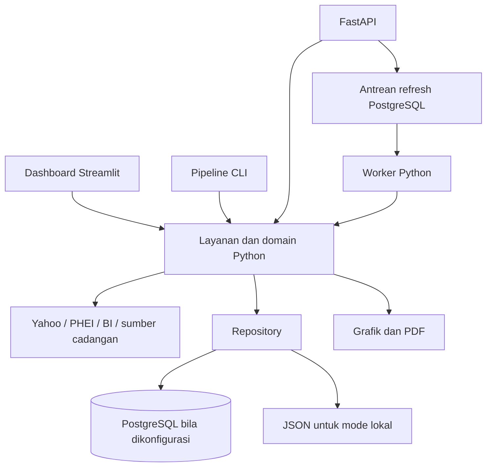

# Project Brief — Daily Market Report / Market Today

Versi dokumen: 1.0  
Tanggal acuan: 2 Oktober 2026  
Status produk: MVP/prototype yang sedang digunakan; pengembangan menuju aplikasi production dilakukan bertahap.

Dokumen ini menjadi acuan bersama untuk memahami produk, menetapkan prioritas, dan mengevaluasi perubahan. Kondisi implementasi dibedakan dari arah pengembangan. Target, peran pengguna, dan kebijakan operasional yang belum disepakati ditandai sebagai usulan atau keputusan terbuka.

## 1. Ringkasan produk

**Daily Market Report** adalah aplikasi informasi pasar yang menyajikan ringkasan harian, perubahan indikator utama, interpretasi kondisi pasar, grafik, dan laporan PDF. **Market Today** merupakan nama tampilan dashboard yang digunakan saat ini.

Produk membantu pembaca memahami kondisi pasar melalui satu tampilan yang terstruktur, dengan kemampuan melihat angka rinci dan sumbernya. Produk juga membantu operator menyiapkan laporan yang konsisten tanpa menyusun ulang data dan grafik secara manual.

Pendekatan pengembangan adalah mempertahankan fitur MVP yang sudah berguna, memperbaiki kualitas data dan pengalaman membaca, lalu memisahkan antarmuka, layanan aplikasi, penyimpanan, dan pekerjaan latar belakang secara bertahap.

## 2. Latar belakang dan masalah yang ditangani

Informasi pasar berasal dari beberapa penyedia dengan format, waktu pembaruan, dan cakupan berbeda. Membaca sumber satu per satu menyulitkan perbandingan antarindikator dan penyusunan laporan dengan konteks yang konsisten.

Masalah yang ingin ditangani:

- Mengurangi pekerjaan berulang saat mengumpulkan data dan menyusun laporan harian.
- Memudahkan pembaca menemukan perubahan penting sebelum masuk ke detail angka.
- Menyediakan penjelasan yang dapat dipahami pembaca dengan tingkat pengetahuan pasar berbeda.
- Menjaga konsistensi antara angka pada dashboard dan laporan yang diunduh.
- Memperjelas asal data, tanggal observasi, dan keterbatasan informasi yang ditampilkan.
- Menyiapkan aplikasi agar dapat dikembangkan dan dioperasikan tanpa ketergantungan pada satu berkas antarmuka yang besar.

Kebutuhan tersebut merupakan dasar pengembangan produk; penghematan waktu dan dampak bagi pengguna belum diukur secara formal.

## 3. Visi dan tujuan

### Visi

Menjadi ruang baca informasi pasar harian yang jelas, dapat ditelusuri, dan mudah digunakan oleh tim, dengan proses penerbitan laporan yang dapat diandalkan.

### Tujuan produk

1. Pembaca dapat memahami kondisi pasar secara cepat melalui ringkasan dan indikator utama.
2. Pembaca dapat menelusuri angka, perubahan, riwayat yang tersedia, dan sumber informasi.
3. Operator dapat memperbarui laporan dan mengetahui keberhasilan atau kegagalan prosesnya.
4. Laporan harian dapat diidentifikasi melalui versi tertentu sehingga hasil pembaruan dapat ditelusuri.
5. Pengembangan antarmuka baru dapat dilakukan tanpa membangun ulang seluruh perhitungan Python.

### Batas tujuan

Lingkup saat ini adalah penyajian informasi dan interpretasi pasar. Eksekusi transaksi, pengelolaan portofolio, rekomendasi investasi personal, dan layanan harga dengan jaminan real-time belum termasuk lingkup yang disepakati.

## 4. Pengguna dan pemangku kepentingan

Peran berikut menjadi acuan kebutuhan produk. Implementasi akun dan hak akses per pengguna belum tersedia.

| Peran | Kebutuhan utama | Hasil yang diharapkan |
|---|---|---|
| Pembaca laporan | Melihat kondisi pasar dan perubahan utama | Memahami ringkasan, lalu menelusuri detail bila diperlukan |
| Analis/tim penyusun | Memeriksa angka, interpretasi, grafik, dan sumber | Memakai laporan sebagai bahan analisis dan komunikasi |
| Operator | Memperbarui data dan memantau proses | Mengetahui laporan mana yang aktif dan apakah pembaruan berhasil |
| Pengelola produk | Mengatur prioritas dan konsistensi pengalaman | Perubahan fitur mengikuti tujuan produk |
| Pengembang/pengelola sistem | Memelihara perhitungan, integrasi, dan deployment | Sistem mudah ditelusuri, diperbaiki, dan dikembangkan |

Pemilik produk, penanggung jawab kualitas data, dan penanggung jawab operasional perlu ditetapkan. Nama individu maupun struktur organisasi tidak ditentukan dalam brief ini.

## 5. Nilai yang diberikan produk

| Nilai | Bentuk dalam aplikasi |
|---|---|
| Informasi terkonsolidasi | FX, indeks, yield, komoditas, dan indikator BI dalam satu dashboard |
| Konteks yang mudah dibaca | Insight harian, interpretasi, dan glosarium |
| Detail yang dapat ditelusuri | Tabel, grafik, serta informasi sumber dan metode |
| Hasil yang dapat dibagikan | Unduhan laporan PDF |
| Konsistensi penerbitan | Pipeline bersama, validasi laporan, dan penyimpanan versi |
| Keberlanjutan pengembangan | Pemisahan domain, layanan, repository, API, dan frontend |

### Arah struktur teknis

Struktur tujuan menggunakan `backend/` untuk aplikasi Python modular, `frontend/` untuk
Next.js, `docs/` untuk dokumentasi permanen, `tools/` untuk utilitas pengembang, dan `runtime/`
untuk keluaran lokal. `legacy/streamlit/` serta `src/app.py` dipertahankan hanya selama masa
transisi. Direktori source Next.js saat ini bernama `frontend/`.
Rincian pemetaan dan tahapan pemindahan ada di [`project_migration.md`](../project_migration.md).

## 6. Lingkup fungsional dan kondisi saat ini

| Area | Cakupan | Kondisi |
|---|---|---|
| Ringkasan pasar | Header, insight harian, interpretasi, angka kunci | Tersedia di Streamlit |
| Detail indikator | FX, indeks, yield, dan komoditas | Tersedia; kelengkapan bergantung pada sumber |
| Monitor pasar | Grafik dan data live dari penyedia | Tersedia; terpisah dari laporan harian |
| Penjelasan | Glosarium, sumber, dan metode | Tersedia |
| Tampilan | Tema terang/gelap dan pengaturan tampilan | Tersedia di frontend Streamlit |
| PDF | Mengunduh laporan dari aplikasi; pipeline CLI | Tersedia secara sinkron |
| Laporan berversi | Laporan aktif, ID laporan, arsip versi | Tersedia melalui repository JSON/PostgreSQL |
| API | Baca laporan, riwayat instrumen, data live | Implementasi tersedia; kontrak masih dalam tahap transisi |
| Antrean refresh | Membuat dan membaca status job; worker terpisah | Refresh Streamlit, CLI live, dan API memakai antrean saat PostgreSQL aktif; perlu verifikasi integrasi |
| Scheduler terpusat | Menjadwalkan refresh melalui antrean | Scheduler configurable dan pencatatan slot PostgreSQL tersedia; jadwal bisnis belum ditetapkan |
| Ekspor latar belakang | Job PDF per versi laporan dan tautan artefak | Endpoint/job tersedia; perlu verifikasi integrasi dan berkas masih disimpan di direktori bersama lokal |
| Frontend pengganti | Next.js + TypeScript | Dashboard di `frontend/` mencakup ringkasan, detail, sumber, glosarium, grafik riwayat, pengaturan tema/teks, dan alur ekspor PDF per versi melalui worker. Production build berhasil, integrasi runtime dan penerimaan pengguna belum diverifikasi |
| Identitas pengguna | Akun, SSO, peran, audit aktivitas pengguna | Belum diimplementasikan |

Keberadaan suatu modul belum berarti modul tersebut telah memenuhi seluruh kebutuhan operasional production.

## 7. Alur penggunaan utama

### A. Membaca laporan harian

1. Pengguna membuka dashboard.
2. Pengguna melihat tanggal laporan dan ringkasan kondisi pasar.
3. Pengguna membaca insight serta perubahan indikator utama.
4. Pengguna membuka detail tabel, grafik, glosarium, atau sumber sesuai kebutuhan.
5. Pengguna mengunduh PDF bila perlu membagikan atau mengarsipkan laporan.

Pengalaman yang dituju: informasi utama mudah ditemukan, angka mudah dibandingkan, dan tanggal data dapat dibedakan dari waktu pembaruan aplikasi.

### B. Memperbarui laporan

Saat ini refresh dapat berjalan langsung dari Streamlit/CLI, atau melalui API dan worker. Pada jalur antrean, operator membuat job, worker mengambil data dan menyusun laporan, kemudian hasil yang valid diterbitkan sebagai versi baru.

Pengalaman yang dituju: operator dapat melihat status menunggu, berjalan, berhasil, atau gagal; laporan aktif terakhir tetap dapat dibaca saat pembaruan gagal; seluruh refresh akhirnya menggunakan satu mekanisme penerbitan yang terkontrol.

### C. Melihat perubahan pasar live

Pengguna membuka monitor pasar untuk melihat data yang diperbarui lebih sering. Data tersebut memiliki waktu dan sumber sendiri, sehingga tidak otomatis mengubah angka laporan harian yang telah diterbitkan.

### D. Menelusuri laporan dan hasil ekspor

Repository dan API sudah menyediakan akses versi laporan. Pengalaman pengguna untuk memilih arsip versi dan mengunduh artefak PDF yang terikat pada versi tertentu masih perlu dikembangkan.

## 8. Data, sumber, dan prinsip kualitas

### Cakupan sumber

| Sumber | Pemakaian saat ini |
|---|---|
| Yahoo Finance | FX, indeks, US Treasury, komoditas, dan monitor live melalui integrasi yang tersedia |
| PHEI | Yield SBN/SBSN |
| Bank Indonesia | BI Rate, INDONIA, dan JISDOR |
| open.er-api | Sumber cadangan kurs tertentu, termasuk derivasi SAR/IDR |

Ketersediaan data bergantung pada respons penyedia, kalender pasar, dan keberhasilan parser. Tidak seluruh indikator memiliki tanggal observasi yang sama.

### Prinsip yang menjadi acuan

- Bedakan **tanggal observasi sumber**, **waktu pengambilan**, dan **waktu publikasi laporan**.
- Data kosong tidak boleh diperlakukan sebagai nilai nol.
- Jelaskan unit, perubahan persentase, perubahan basis point, dan sumber sesuai indikator.
- Pisahkan data demo dari laporan aktif.
- Dashboard dan PDF harus memakai versi laporan yang sama untuk angka laporan harian.
- Publikasi versi baru tidak boleh merusak laporan aktif bila proses gagal.
- Seluruh kolom tanggal/waktu fisik pada schema database menggunakan nama **`dates`**, sesuai keputusan proyek.
- Nama metadata payload seperti `published_at` dan `report_date_iso` tetap memiliki makna tersendiri; aturan nama kolom database tidak otomatis mengganti seluruh properti JSON.

Validasi publikasi saat ini menolak laporan demo dan mensyaratkan setidaknya dua nilai `today` numerik yang valid dari kelompok pasar. Ini merupakan pemeriksaan dasar; pemeriksaan kelengkapan per instrumen, kesegaran, dan kewajaran perubahan masih perlu diperkuat.

Riwayat SBN saat ini dibatasi hingga 30 titik dan pengumpulannya masih terkait render dashboard. Riwayat instrumen lain yang tersedia di API sebagian berasal dari snapshot laporan aktif. Sistem belum menjadi gudang data historis lengkap.

## 9. Arah desain dan pengalaman pengguna

Desain ditujukan untuk membaca laporan pasar secara profesional, dengan hierarki informasi yang jelas dan kepadatan angka yang tetap nyaman dibaca.

Pedoman pengembangan:

- Urutan halaman: identitas/tanggal laporan → ringkasan → insight → angka kunci → grafik/detail → sumber dan unduhan.
- Gunakan tipografi, jarak, warna, dan komponen yang konsisten.
- Format angka mengikuti unit instrumen dan menggunakan presisi yang konsisten.
- Warna membantu membaca perubahan; label atau simbol tetap menjelaskan maknanya.
- Bedakan area laporan harian dan monitor live secara jelas.
- Sediakan kondisi loading, data kosong, data sebagian, data lama, dan kegagalan yang mudah dipahami.
- Pertahankan keterbacaan pada tema terang/gelap serta layar desktop dan perangkat lebih kecil.
- PDF mengikuti identitas visual produk sekaligus mempertahankan keterbacaan saat dicetak.

Pada frontend baru, komponen ringkasan, kartu indikator, tabel, grafik, status data, dan unduhan perlu memiliki spesifikasi bersama agar perubahan tampilan tetap konsisten.

## 10. Arsitektur dan struktur proyek

### Kondisi implementasi

Streamlit masih memanggil layanan Python secara langsung. API dan worker menggunakan layanan yang sama. Diagram menunjukkan hubungan modul; tidak seluruh pemanggilan layanan mengambil data dari penyedia atau menghasilkan PDF.

| Lokasi | Tanggung jawab |
|---|---|
| `src/app.py` | Entry point kompatibilitas dashboard Streamlit |
| `legacy/streamlit/` | Aplikasi lama serta komponen, tema, dan halamannya |
| `backend/src/market_report/domain/` | Logika dan analisis pasar |
| `backend/src/market_report/services/` | Alur laporan, riwayat, live, ekspor, dan refresh |
| `backend/src/market_report/infrastructure/repositories/` | Repository JSON dan PostgreSQL untuk laporan, riwayat, job, serta artefak |
| `backend/src/market_report/presentation/` | Format angka dan komponen grafik/presentasi |
| `backend/src/market_report/api/` | Endpoint, schema respons, dan autentikasi API |
| `backend/src/market_report/worker/` | Pemrosesan antrean refresh |
| `backend/src/market_report/fetch_data.py`, `calculate.py` | Pengambilan sumber dan pembentukan laporan |
| `backend/pyproject.toml`, `backend/requirements.txt` | Metadata package dan dependensi backend |
| `backend/migrations/` | Migrasi schema PostgreSQL |
| `tests/` | Pengujian yang tersedia |
| `runtime/data/`, `runtime/charts/`, `runtime/reports/` | Data lokal dan keluaran pipeline |

### Arsitektur tujuan

Frontend Next.js + TypeScript mengakses FastAPI. Backend Python mempertahankan perhitungan dan analisis. PostgreSQL menyimpan laporan, riwayat, dan job. Worker menangani refresh serta ekspor, dengan scheduler mengirim pekerjaan melalui antrean yang sama. Streamlit dipertahankan selama transisi sampai kesetaraan fungsi pengganti terbukti.

Backend kini memakai package `market_report` dengan susunan `src/` dan konfigurasi package tersendiri. Streamlit lama mengakses package yang sama melalui entry point kompatibilitas. Pemisahan tanggung jawab dan kontrak data tetap menjadi prioritas sebelum penghapusan frontend lama.

## 11. Penyimpanan dan kontrak integrasi

### Penyimpanan saat ini

| Tabel PostgreSQL | Fungsi |
|---|---|
| `report_versions` | Payload JSONB dan metadata versi laporan |
| `active_report` | Penunjuk versi laporan aktif |
| `sbn_history` | Riwayat SBN per tanggal sumber |
| `refresh_jobs` | Status dan percobaan job refresh |
| `refresh_job_events` | Riwayat peristiwa job |
| `report_artifacts` | Metadata artefak PDF terkait versi laporan |
| `refresh_schedule_runs` | Slot scheduler yang sudah diproses dan job terkait |
| `schema_migrations` | Catatan migrasi schema yang diterapkan |

`DATABASE_URL` menentukan penggunaan PostgreSQL. Tanpa konfigurasi tersebut, repository laporan/riwayat menggunakan JSON lokal. Jika PostgreSQL telah dikonfigurasi tetapi gagal diakses, sistem tidak beralih diam-diam ke JSON. Antrean job memerlukan PostgreSQL.

### API saat ini

| Endpoint | Kegunaan | Akses |
|---|---|---|
| `GET /health` | Mengetahui proses API hidup | Terbuka |
| `GET /docs` | Dokumentasi endpoint | Terbuka |
| `GET /api/v1/reports/latest` | Membaca laporan aktif | Token baca |
| `GET /api/v1/reports/{report_id}` | Membaca versi tertentu | Token baca |
| `GET /api/v1/instruments/{instrument_id}/history` | Riwayat yang tersedia, dengan filter `from`/`to` | Token baca |
| `GET /api/v1/market/live` | Data live dengan cache 30 detik per proses API | Token baca |
| `POST /api/v1/refresh-jobs` | Meminta refresh melalui antrean | Token operator |
| `GET /api/v1/jobs/{job_id}` | Membaca status dan peristiwa job | Token baca |
| `POST /api/v1/reports/{report_id}/exports` | Meminta PDF untuk versi tertentu | Token baca |
| `GET /api/v1/reports/{report_id}/exports/pdf` | Mengunduh PDF untuk versi tertentu | Token baca |
| `GET /api/v1/artifacts/{artifact_id}` | Mengunduh artefak berdasarkan ID | Token baca |

Token dikirim melalui `Authorization: Bearer ...`. Token baca dan operator adalah kredensial terpisah. Mekanisme ini belum merupakan login pengguna atau otorisasi per individu. Token server harus tetap di sisi server ketika frontend browser baru dikembangkan.

`/health` saat ini memeriksa proses API saja. Schema laporan masih bersifat transisi, dengan beberapa bagian mengikuti payload lama; kontrak domain yang sepenuhnya terstruktur belum selesai.

## 12. Operasional, keamanan, dan keandalan

Konfigurasi lokal menggunakan `.env` dengan `DB_USER`, `DB_PASSWORD`, `DB_HOST`, `DB_PORT`, `DB_NAME`, `DATABASE_URL`, `API_READ_TOKEN`, `API_OPERATOR_TOKEN`, `REFRESH_TIMES`, dan `REPORT_ARTIFACT_DIR`. Contoh struktur tersedia di `.env.example`; nilai kredensial tidak termasuk dokumentasi atau repository. Proses perlu dimulai ulang setelah perubahan konfigurasi. Login operator membatasi lima kegagalan per alamat klien dalam jendela 15 menit, lalu menahan percobaan selama 15 menit. Penghitung ini berada di memori proses Next.js dan ditujukan untuk satu instance; sebelum menjalankan beberapa instance, pindahkan pembatasan ke penyimpanan bersama.

Operasional yang dituju mencakup:

- Jadwal pembaruan sesuai kebutuhan pengguna dan kalender sumber.
- Log serta status job yang dapat ditelusuri melalui `job_id` dan `report_id`.
- Pemeriksaan kesiapan database/worker selain pemeriksaan proses API.
- Backup dan pemulihan database serta artefak laporan. Worker dan API harus memakai lokasi artefak persisten yang sama melalui `REPORT_ARTIFACT_DIR`.
- Deployment yang dapat diulang, dependensi terkunci, dan pemeriksaan otomatis sebelum rilis.
- Pengelolaan akses pengguna, rahasia konfigurasi, serta pencatatan aktivitas bila lingkup penggunaan berkembang.

Antrean mendukung deduplikasi job aktif per jenis/versi, pengambilan job dengan row lock, maksimal tiga percobaan, token kepemilikan, heartbeat 30 detik, lease dua menit, dan penguncian kepemilikan saat publikasi/ekspor. Pemulihan job menggunakan lease yang kedaluwarsa. Jeda retry belum tersedia. Saat PostgreSQL aktif, refresh Streamlit, CLI live, dan API masuk ke antrean. Mode JSON lokal tetap menerbitkan langsung untuk pengembangan.

Publikasi laporan dan pencatatan keberhasilan job berada pada transaksi terpisah. Pemulihan setelah crash masih dapat menerbitkan versi tambahan; idempotensi publikasi dan jeda retry menjadi pekerjaan lanjutan.

Skrip `backend/src/market_report/migrate_reports_to_postgres.py` menerapkan schema sekaligus mengimpor data lokal. Impor dapat menjadikan laporan aktif lokal sebagai laporan aktif database; skrip ini bukan perintah refresh rutin. Migrasi yang sudah diterapkan sebaiknya dipertahankan, dengan perubahan schema berikutnya melalui migrasi baru.

## 13. Roadmap dan urutan prioritas

| Tahap | Hasil yang dituju | Posisi saat ini | Kriteria selesai |
|---|---|---|---|
| 1. Fondasi bersama | Perhitungan/publikasi terpisah dari tampilan | Sudah diterapkan; perlu terus dijaga | Semua jalur memakai aturan perhitungan dan validasi yang konsisten |
| 2. Repository | Laporan aktif dan versi di PostgreSQL | Sudah diterapkan | Impor, kegagalan publikasi, dan pemulihan penyimpanan tervalidasi |
| 3. API | Kontrak baca dan akses backend yang stabil | Implementasi awal tersedia | Kontrak, autentikasi, serta kesetaraan angka diverifikasi melalui integrasi |
| 4. Worker | Refresh, scheduler, dan ekspor di latar belakang | Sebagian: refresh UI/CLI/API terantrekan; scheduler, job ekspor, dan endpoint unduh tersedia; uji lokal terisolasi untuk enqueue, alur worker, kegagalan ekspor, dan dispatch scheduler lulus | Integrasi PostgreSQL dan HTTP terverifikasi, jadwal bisnis, penyimpanan artefak persisten, serta pemulihan tersedia |
| 5. Frontend baru | Next.js mencapai kesetaraan fitur baca MVP | Dashboard baca, grafik riwayat, tema/teks, dan alur ekspor PDF tersedia; build serta pemeriksaan TypeScript berhasil | Integrasi API dengan data representatif, worker ekspor, responsif, serta penerimaan alur baca diverifikasi |
| 6. Fitur operasional frontend | Monitor live dan refresh operator di Next.js | Implementasi monitor, fallback snapshot, sesi operator, refresh worker, dan batas login lokal tersedia | Alur API/worker, kontrol akses deployment, polling refresh, dan fallback sumber diverifikasi |
| 7. Transisi penggunaan | Pengguna beralih secara terkendali | Belum dimulai | Data/fitur setara, observasi operasional memadai, rollback tersedia |
| 8. Penguatan production | Deployment, monitoring, akses, dan pemulihan | Belum selesai | Kriteria operasional dan keamanan yang disepakati terpenuhi |

Penguatan kualitas, keamanan, dan pengujian dilakukan sepanjang tahap; tidak seluruhnya ditunda sampai tahap terakhir.

**Prioritas implementasi berikutnya:** memverifikasi antrean, ekspor artefak, dan scheduler melalui alur operasional lengkap; memeriksa kontrol akses deployment; lalu menguatkan penyimpanan artefak dan pembatasan login bersama untuk deployment multi-host. Laporan baru menyimpan riwayat SBN yang dipakai saat PDF dibuat; laporan lama belum memiliki riwayat terikat versi. Pengumpulan riwayat SBN sudah dipindahkan dari render UI ke pipeline penerbitan laporan.

Tanggal target, kapasitas tim, anggaran, serta urutan detail backlog belum ditetapkan.

## 14. Kriteria keberhasilan dan penerimaan

### Produk dan pengalaman pengguna

- Pengguna dapat menemukan tanggal laporan, ringkasan, angka utama, detail, dan PDF tanpa arahan pengembang.
- Tanggal data, sumber, dan kondisi data tidak tersedia dapat dipahami dari tampilan.
- Dashboard dan PDF memiliki angka harian yang sama untuk `report_id` yang sama.
- Fitur penting MVP tetap tersedia selama transisi dan setelah frontend pengganti digunakan.

### Data dan sistem

- Refresh gagal tidak menggantikan laporan aktif dengan hasil tidak valid.
- Akses API sesuai peran token dan respons tidak membocorkan metadata sumber internal atau kredensial.
- Worker yang kehilangan kepemilikan job tidak dapat menyelesaikan atau menimpa hasil worker pengganti.
- Riwayat dan artefak yang diperlukan untuk mereproduksi laporan memiliki hubungan versi yang jelas.
- Backup dapat dipulihkan dan aplikasi dapat dijalankan kembali dari prosedur yang terdokumentasi.

### Ukuran yang perlu mulai dicatat

| Ukuran | Tujuan pengukuran |
|---|---|
| Waktu penyusunan laporan | Menilai pengurangan pekerjaan manual |
| Keberhasilan dan durasi refresh | Menilai keandalan pipeline |
| Kelengkapan/kesegaran per sumber | Mengidentifikasi masalah data sebelum publikasi |
| Waktu muat dashboard/API | Menilai kenyamanan penggunaan |
| Konsistensi dashboard/PDF/API | Menilai kesetaraan lintas kanal |
| Temuan dan umpan balik pengguna | Menentukan prioritas perbaikan produk |

Baseline dan target numerik belum tersedia. Target ditetapkan setelah kebutuhan operasional dan hasil pengukuran awal diketahui.

Pemeriksaan lokal mencakup pipeline/UI/PDF pada tahap terdahulu, pemeriksaan TypeScript dan lint untuk berkas frontend yang berubah, serta tujuh uji terisolasi untuk kontrak API, enqueue refresh, alur worker memakai repository tiruan, kegagalan ekspor PDF, dan dispatch scheduler. Uji worker ini tidak menulis ke database pengguna. Integrasi melalui HTTP dan PostgreSQL, konkurensi/pemulihan, serta uji rute batas login belum diverifikasi. Lint penuh frontend masih memiliki tiga temuan pada berkas lain yang sudah ada.

## 15. Ketergantungan dan keputusan terbuka

| Topik | Hal yang perlu ditetapkan |
|---|---|
| Kepemilikan produk | Penanggung jawab prioritas, penerimaan fitur, dan kualitas interpretasi |
| Pengguna | Kelompok pembaca, jumlah pengguna, dan kebutuhan akses eksternal |
| Jadwal laporan | Jam publikasi, frekuensi refresh, zona waktu tampilan, dan penanganan hari libur |
| Kualitas data | Indikator wajib, batas data lama, dan kebijakan laporan parsial |
| Riwayat | Periode retensi, cakupan instrumen, serta reproduksi laporan/PDF |
| Infrastruktur | Lingkungan deployment, domain, TLS, penyimpanan artefak, dan backup |
| Akses | Kebutuhan login/SSO, peran operator, serta audit aktivitas |
| Desain | Identitas visual final, perangkat prioritas, dan penerimaan pengguna |
| Operasional | Target ketersediaan, pemulihan, serta pihak yang menangani kegagalan |

Ketergantungan utama meliputi akses database, ketersediaan penyedia data, format halaman/API penyedia, serta sumber daya pengembangan. Perubahan parser, kegagalan sumber, dan riwayat yang belum lengkap perlu dipantau sebagai keterbatasan produk saat ini.

## 16. Cara menggunakan dan memelihara brief

- Gunakan brief ini untuk menilai apakah usulan perubahan mendukung tujuan produk dan tahap yang sedang dikerjakan.
- Perbarui kondisi fitur dan roadmap setelah suatu tahap selesai dan memiliki bukti verifikasi.
- Catat keputusan baru tentang pengguna, kualitas data, akses, retensi, dan deployment pada bagian terkait.
- Pisahkan fitur yang tersedia, fitur yang baru memiliki implementasi awal, dan rencana yang belum dikerjakan.
- Hindari memasukkan kredensial, isi `.env`, atau data sensitif ke dokumentasi.

### Dokumen pendamping

- [README.md](../README.md): instalasi, menjalankan aplikasi, konfigurasi, dan penggunaan teknis.
- [project_migration.md](../project_migration.md): dokumen migrasi sementara. Peta struktur kode akhir mengacu pada bagian struktur proyek di dalamnya. Dokumen ini tetap dipakai selama migrasi, lalu dipindahkan/dirangkum ke acuan permanen dan dihapus hanya setelah tahap migrasi selesai serta struktur akhir telah diverifikasi.
- [src/](../src/): entry point kompatibilitas dan ikon Streamlit.
- [backend/](../backend/): layanan API, domain, worker, scheduler, dan migrasi.
- [legacy/streamlit/](../legacy/streamlit/): dashboard Streamlit selama transisi.

Brief ini merupakan acuan holistik produk. README menjadi panduan menjalankan proyek, sedangkan rancangan migrasi memberikan detail arah teknis.
